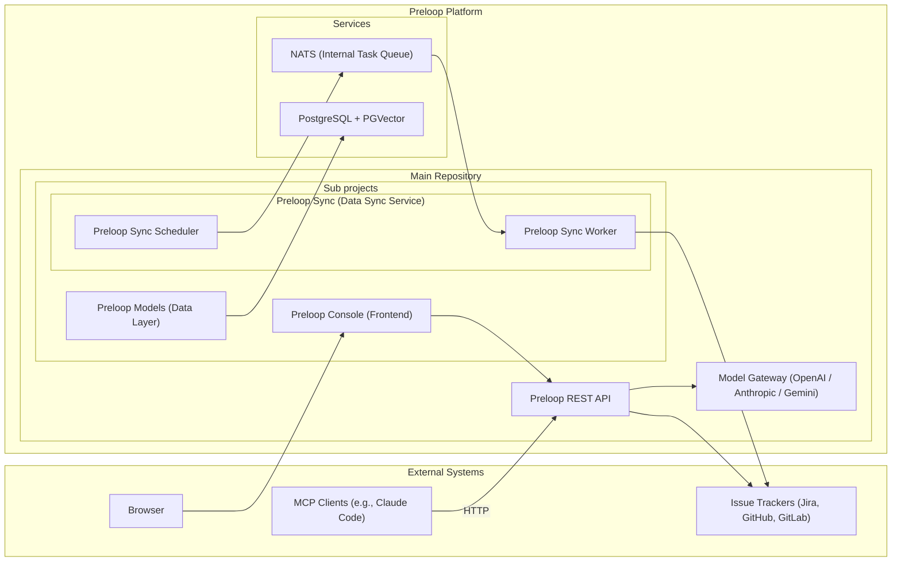

# Preloop Architecture

Preloop is an open-source, responsible AI automation platform. It can proxy tools from MCP servers, optionally adding a human approval layer with configurable policies. It provides event-driven agentic flows to intelligently automate common tasks using the agent harnesses registered in `preloop.agents.factory`: OpenHands, Aider, Codex CLI, Gemini CLI, OpenCode, Pi and DeepSeek Harness. It integrates with issue & code tracking systems like Jira, GitHub, GitLab, both for listening to events and for ingesting issues, comments, documentation and code. By leveraging vector-based similarity search, Preloop detects duplicate and overlapping issues, detects unmapped dependencies, evaluates compliance metrics, and offers intelligent suggestions to streamline workflows. The architecture now also includes Preloop-owned model-gateway surfaces so managed runtimes can route model traffic through a central enforcement point for telemetry, budgets, session observability, and secret custody. The architecture emphasizes flexibility, performance, and ease of integration, providing access via a REST API, a web UI, and an MCP server for various clients.

ARCHITECTURE.md is the map. Read one chapter under `docs/architecture/` for the subsystem you are changing. Do not load every chapter for context.

Implementation PRs can use [durable feedback subscriptions](docs/guide/flows/durable-implementation-feedback.md): PostgreSQL threads and inbox leases coordinate new execution turns, while native conversation artifacts remain isolated from workspace checkpoints. Repository events and bounded reconciliation advance CI/review gates without idle agent containers. Feedback opt-in applies to future executions; a preview-and-adopt API binds one older publication explicitly. Live policy changes are checked again at atomic repair reservation. Missing native checkpoints fail closed unless the operator explicitly selected a source-only published-branch handoff. Unreadable repository requirements prevent readiness while fully verified feedback can still authorize bounded repairs.

[Isolated publication](docs/guide/flows/automated-issue-implementation.md#isolated-publication-rollout-and-repair) verifies immutable bundles in fresh credential-free runtimes before acquiring a write lease. Controller-owned evidence reuse binds the execution, bundle, base, profile, pinned image and runtime; sandbox-written evidence cannot populate it. Failed durable repairs retain their latest workspace and native session while recovering only the prior published branch binding from authenticated thread ancestry.
Private-runner log batches use stable delivery identities and acknowledgments so a reconnect can replay unconfirmed output without duplicating stored rows. Socket writes have deadlines, live log broadcasts have a bounded budget, and runner lease release shares the terminal result transaction. Publication and native-session markers are saved while output arrives. The execution console refreshes runner assignment and failure details at lifecycle transitions; an execution without an observed runtime is shown as unassigned.

HTTP model gateways use immutable execution values and fresh worker-owned database
units for authentication, preparation and accounting. Provider waits and stream
pulls retain no Session. See [Gateway database ownership](docs/architecture/gateway.md#gateway-database-ownership)
for protocol boundaries, cancellation and the serialized OAuth rotation exception.

The [account kill switch](docs/guide/account-kill-switch.md) serializes halt transitions and runtime admission on the account row. Audit records and durable execution stop intent share the transition transaction. Monitors and recovery workers distinguish a stop request from confirmed runtime termination; approval deadlines recover once by their actual frozen interval.

Database worker ownership, row-lock compatibility, and cancellation rules are
documented in [Transactions and asynchronous request handling](docs/architecture/data-model.md#transactions-and-asynchronous-request-handling).

Agent harnesses are told the [context window and output ceiling](docs/guide/model-context-limits.md)
of the model they run on, taken per field from `model_parameters` on the model
row and then from the vendored catalog. An unknown limit is omitted rather
than guessed, so the harness keeps its own default.

[Reviewed price feeds](docs/guide/model-price-refresh.md) update the generic model
map and Alibaba's dedicated regional tariff store in each API, gateway, and
worker process. Alibaba estimates retain input tiers and distinct implicit,
explicit, and cache-creation rates. Native discovery keeps credentials on their
documented host; workspace routes can use reviewed regional prices without a
cross-host credential transfer. Weekly review produces a PR with source evidence
and verification gates. Feed ingestion never rewrites historical usage.

Audit rows are sealed into a per-account hash chain with signed checkpoints.
Period exports and evidence packs carry detached Ed25519 signatures.
`preloop audit verify` and `preloop evidence verify` recompute both on the
caller's machine. See [Evidence storage and signed records](docs/guide/flows/evidence-storage.md).
The chain proves order and non-deletion in the range it names, not that the
records were true when written; the signing key lives beside the records.

Cloud analytics history is resolved through a billing plugin service at reporting boundaries. Physical retention preserves longer subscription promises through account-locked CRUD updates and remains separate from audit/evidence policy and live governance. See [Cloud analytics history and stored records](docs/guide/flows/evidence-storage.md#cloud-analytics-history-and-stored-records).

The Cost console loads totals independently of settings and tab breakdowns.
Selective reporting queries and per-section loading states are described in
[Progressive reporting](docs/architecture/cost.md#progressive-reporting).

## High-Level Architecture

## Chapters

| Chapter | What it covers |
|---|---|
| [Overview](docs/architecture/overview.md) | High-level layout, key components, and the REST search path. Start here for how the API, console, sync, and gateway fit together. |
| [Frontend](docs/architecture/frontend.md) | Console structure (Lit, Vite, TypeScript, Shoelace). Tracker detail, tools page, and cost views. |
| [Model gateway](docs/architecture/gateway.md) | OpenAI-, Anthropic- and Gemini-compatible ingress (`/openai/v1`, `/anthropic/v1`, `/gemini/v1beta`), accounting, budgets, and runtime session identity. |
| [Governance](docs/architecture/governance.md) | Subject-scoped allowed models, tool access rules, and tool output filters. |
| [Approvals](docs/architecture/approvals.md) | Tool configuration, human-in-the-loop approval workflows, `ask_user`, and native-tool permission-check. |
| [Agent Control](docs/architecture/agent-control.md) | Operator channel to managed agents, operator notes delivered at the next turn boundary through the gateway or a permission hook, CLI/desktop enrollment, mobile/watch voice contact, and persistent flow execution on a live Agent Control target. |
| [Cost](docs/architecture/cost.md) | `ApiUsage` ledger, OSS spend and budget-health surfaces, and the Enterprise plugin boundary. |
| [Sync](docs/architecture/sync.md) | Tracker polling, NATS scheduler/worker, issue tracker clients, and tracker scope rules. |
| [Data model](docs/architecture/data-model.md) | `preloop.models`, PostgreSQL + PGVector, schema, and backend project layout. |
| [MCP](docs/architecture/mcp.md) | FastMCP integration, dynamic tool filtering, and the HTTP MCP request path. |
| [Realtime](docs/architecture/realtime.md) | Unified WebSocket, MessageRouter topics, and account-scoped pub/sub. |
| [Security](docs/architecture/security.md) | Auth and tenancy, per-user JWT `auth_generation` / revoke-all, redaction, secret custody, audit hash chain, record signing, security-screen scoring, and `preloop.security`. |
| [Decisions](docs/architecture/decisions.md) | Why FastAPI, Python, and PostgreSQL, and how the stack is deployed (Compose, Helm, service roles). |
| [Flows](docs/architecture/flows.md) | Event-driven agentic flows, remote runners, matrix/batch fan-out, delegation and execution trees, label-based model routing, eval artifacts, evidence packs, prompt `truncate(N)`, and the chunked agent launch-payload environment. |

Execution environment profiles and hosted checkpoint recovery are documented in
[Environments and recovery](docs/guide/flows/environments-and-recovery.md).
The sandboxed-browser allowlist sidecar lives in
[`environments/egress-proxy`](environments/egress-proxy/README.md).

### Flow delegation and execution trees

A flow execution can start another flow of the same account as a child of
itself through the default-off `run_flow` tool, gated by both the flow's
`allowed_mcp_tools` and its `callable_flows` allowlist. `FlowExecution` carries
`parent_execution_id`, `root_execution_id` and `delegation_depth`, so a subtree
is one query and rows that predate the columns read back as roots.
`GET /api/v1/flows/executions/{id}/tree` returns an execution, its descendants
and a rollup in the same shape the batch listing uses. `run_flow(wait=true)`
waits in process briefly and then parks the parent on `WAITING_FOR_CHILDREN`,
releasing the container, the runner and the runtime token exactly as a park on
a human decision does; the parent resumes as a new execution that natively
continues the same agent session. Depth, fan-out and subtree cost are bounded
by `FLOW_DELEGATION_MAX_DEPTH`, `FLOW_DELEGATION_MAX_CHILDREN` and
`FLOW_DELEGATION_MAX_TREE_USD`. See
[Flow delegation](docs/guide/flows/flow-delegation.md).

### Telemetry export

Optional OpenTelemetry export (`preloop.services.otel_export`, disabled by
default) emits GenAI spans for governed model calls and MCP tool calls to any
OTLP endpoint, carrying `gen_ai.conversation.id` when a runtime session id is
present. Token and cost attributes match the `ApiUsage` row for that request;
prompts, completions and tool arguments are not attached. Exporter errors are
logged and never fail the user-facing call. It supplements the `ApiUsage`
ledger rather than replacing it. See [OTLP export](docs/guide/observability-otlp.md).

### Agent launch payload (custom images and runners)

Linux caps one `execve` string (a single argv element or a single
`NAME=value` environment entry) at `MAX_ARG_STRLEN`, 131072 bytes. The
control plane therefore does not put an unbounded prompt or Kubernetes
inner script in one string.

The rendered prompt travels as `PRELOOP_AGENT_PROMPT_0..N` (plus
`PRELOOP_AGENT_PROMPT_CHUNKS` and `PRELOOP_AGENT_PROMPT_BYTES`), is
reassembled into `/tmp/preloop/prompt.txt`, and is advertised as
`AGENT_PROMPT_FILE`. `AGENT_PROMPT` is set only when the prompt is 64 KiB
or less. The Kubernetes inner script uses the same pattern:
`PRELOOP_INNER_SCRIPT_0..N` into `/tmp/preloop/agent-script.sh`, with a
legacy whole-value `PRELOOP_INNER_SCRIPT` still honoured so old and new
images interoperate.

Custom images and private runners should read `AGENT_PROMPT_FILE` (or
reassemble the chunks) and must not require `AGENT_PROMPT` for large
prompts. The full contract is in
[Agent launch payload (container environment)](docs/architecture/flows.md#agent-launch-payload-container-environment).
Private Docker launch shape is in the
[runner image contract](docs/guide/runners/quickstart-linux.md#what-the-runner-executes).

### Issue lifecycle controller

`services/issue_lifecycle.py` coordinates structured readiness, one authorized
implementation pickup, and independent merge/deployment acceptance audits.
`IssueLifecycle` records live scope revisions, immutable merge references,
execution bindings, evidence and follow-up identities through the CRUD layer.
Transaction locks serialize each tenant/issue; provider markers recover external
writes after local rollback. The trigger service prepares lifecycle executions
before ordinary dispatch, and the orchestrator consumes durable structured output
at completion. The GitHub adapter revalidates closing-commit/merged-PR authority;
manual completion alone does not start an audit. Readiness consumes approved
execution-environment capabilities rather than implementing test setup. See
[Issue readiness and completion audits](docs/guide/flows/issue-lifecycle.md) for
policy, API and recovery configuration.

`services/issue_triage_controller.py` reuses this ledger for durable issue-revision
claims across manual and automatic triage. Dedicated advisory-lock connections
serialize local applies while provider-write intents commit durably. Execution
credentials bind managed writes to their issue/revision; successful bounded
assessment packets retain input/output revision and policy/context identity.
Readiness consumes only applicable server-loaded packets as evidence, preserving
its separate implementation authorization. Provider writes remain optimistic;
local serialization cannot make external APIs support compare-and-swap. See
[Issue triage](docs/guide/flows/issue-triage.md) for recovery and tool boundaries.

### Security maintenance controller

`services/security_maintenance.py` coordinates opt-in supported-release
inventory, one work item per product/release/advisory/component, and
fail-closed completion. Inventory is API-configured. Implementation uses the
existing flow dispatcher and isolated publication receipts (`head_sha`).
After approval, a rebuilt SBOM must be submitted for the published commit;
recheck does not reuse the original inventory. Removal is derived from
identities in those submitted bytes, not from model inventory omission.
Initial baseline acceptance requires the controller envelope `release_id` and
the digest of the supplied SBOM. Tests and baselines require
controller-owned verification and the contracts CRA validator; caller-supplied
evidence ids and agent `finding_absent` fields do not grant. Platform
`ApprovalRequest` rows carry human decisions. Dispatch claims expire so a
crash between claim and enqueue cannot strand a still-`PENDING` execution.
Audit/recheck completion observes frozen Git bundles from evidence when the
flow names repository URLs and the pin is an exact git SHA; `HEAD.txt` is
not checkout proof.
See [Supported-release vulnerability maintenance](docs/guide/flows/security-maintenance.md).

Session search writes one `session_search_document` chunk per source row
(gateway interaction, transcript, tool call, operator note, summary). Keyword
indexing is gated by `SESSION_SEARCH_INDEX_ENABLED`. Optional vectors are a
separate per-account opt-in (`session_embedding_setting`, `summaries_only` by
default so an opt-in embeds the session's title and summary chunk unless the
account asks for `full`) plus the
deployment kill switch `SESSION_EMBEDDING_ENABLED`; a bounded worker posts
batches to an OpenAI-compatible endpoint or a local model, caps spend, and
records purpose-tagged usage. The shared API key is allow-listed.
`POST /api/v1/runtime-sessions/search` reads it in `keyword`, `semantic` or
`hybrid` mode, fusing the two candidate lists by rank; a half that cannot run
is reported in a degraded block with keyword results, never as an error.
`GET /api/v1/runtime-sessions/{id}/similar` reads the same vectors with no
query at all: a session is compared by a stride sample of its own chunks, in
its own model's space, and spends nothing.
See [Similar sessions](docs/architecture/similar-sessions.md).
A question worth repeating can be saved under a name in `session_saved_search`
and re-run from `/runtime-sessions/search/saved`; a saved search stores the
question and never the answer, is private until its author shares it with the
account, and a run says which of its filters no longer resolve.
The same ranked search is reachable as the built-in `search_sessions` tool
(default off, own-sessions scope unless an operator grants `account`) and from
`preloop sessions search`. Every content search writes one audit row through
the ordinary audit path, with the mode, the filters, the result count and a
stable hash of the query; the query text itself is stored only when the account
opts in.
Operator knobs: [Session search](docs/operations/session-search.md) (coverage,
the history backfill, who may search) and
[Session embedding](docs/operations/session-embedding.md) (the vector worker).
Saved searches: [Saved session searches](docs/guide/session-saved-searches.md).
Search auditing: [Auditing session content search](docs/guide/session-search-audit.md).
The agent-facing tool: [search_sessions](docs/guide/agent-session-search.md).

### Pi and DeepSeek Harness adapters

The `pi` and `deepseek` kinds share `ExtensionHarnessAgent` for hosted and private
Docker launches. `runtime-plugins/harness-preloop` supplies Pi extensions and
DeepSeek Cordis plugins for MCP, fail-closed native approvals, lifecycle ingest,
and authenticated active-session control. CLI enrollment owns a separate
`preloop.json`, preserving native configuration, and registers only its own
loader or marked patch nodes. DeepSeek's released headless startup is replaced
with a stdin provider to keep prompts outside argv. Execution-scoped credentials
can request native approvals only for their own active flow session. See the
[adapter guide](runtime-plugins/harness-preloop/README.md) for version pins,
capability limits, and publication order.

### Remote agent deployment

The optional agent-deployment API authorizes account owners and administrators,
then runs CLI installation and live onboarding through a host-key-pinned SSH
connection. The GCP adapter creates a uniquely named VM without cloud identity,
reads its host key through the authenticated Compute API, and removes resources
on failure. Before returning success, the API checks the account's registered
agent and selected model binding through CRUD. Credentials stay in request
memory; audit events contain deployment identifiers and outcomes. See
[operator configuration](docs/operations/agent-deployment.md).
