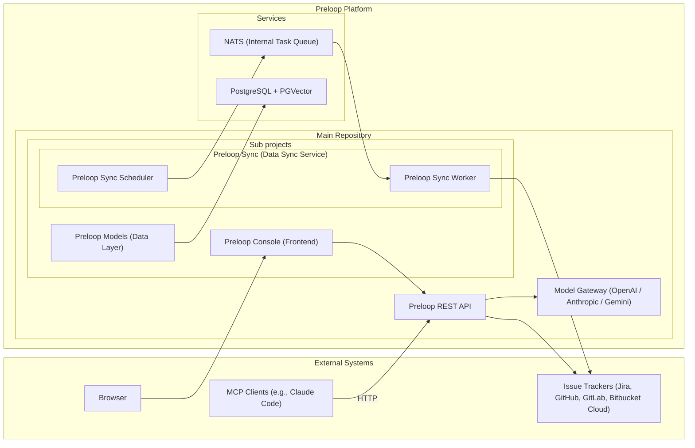

# Preloop Architecture

Preloop is an open-source, responsible AI automation platform. It can proxy tools from MCP servers, optionally adding a human approval layer with configurable policies. It provides event-driven agentic flows to intelligently automate common tasks using the agent harnesses registered in `preloop.agents.factory`: OpenHands, Aider, Codex CLI, Gemini CLI, OpenCode, Pi and DeepSeek Harness. It integrates with issue & code tracking systems like Jira, GitHub, GitLab, Bitbucket Cloud, both for listening to events and for ingesting issues, comments, documentation and code. By leveraging vector-based similarity search, Preloop detects duplicate and overlapping issues, detects unmapped dependencies, evaluates compliance metrics, and offers intelligent suggestions to streamline workflows. The architecture now also includes Preloop-owned model-gateway surfaces so managed runtimes can route model traffic through a central enforcement point for telemetry, budgets, session observability, and secret custody. The architecture emphasizes flexibility, performance, and ease of integration, providing access via a REST API, a web UI, and an MCP server for various clients.

ARCHITECTURE.md is the map. Read one chapter under `docs/architecture/` for the subsystem you are changing. Do not load every chapter for context.

Live session supervision uses shared Lit state and tool/approval cards across
Talk, Conversation and Transcript. Gateway starts and accounting completions
share a per-request identity; captured OpenAI, Responses and Anthropic tool
metadata has a 64 KiB aggregate bound and follows capture/redaction policy.
Approval REST queries combine account and runtime-session scope, and websocket
approval payloads pass the same permission boundary before delivery. See
[Runtime sessions](docs/guide/concepts/runtime-sessions.md#following-live-work-and-decisions).

[Employee event intake](docs/guide/virtual-employees.md) authenticates provider events, verifies Flow/account/source scope, reserves the existing delivery-keyed execution before dispatch, and reuses Flow worker claims and recovery. Managed-agent control commands carry encrypted execution credentials; Codex/Nanobot tasks use independent bounded conversations and command-owned interruption.

Implementation PRs can use [durable feedback subscriptions](docs/guide/flows/durable-implementation-feedback.md): PostgreSQL threads and inbox leases coordinate new execution turns, while native conversation artifacts remain isolated from workspace checkpoints. Repository events and bounded reconciliation advance CI/review gates without idle agent containers. Feedback opt-in applies to future executions; a preview-and-adopt API binds one older publication explicitly. Live policy changes are checked again at atomic repair reservation. Missing native checkpoints fail closed unless the operator explicitly selected a source-only published-branch handoff. Unreadable repository requirements prevent readiness while fully verified feedback can still authorize bounded repairs.

[Restricted CI administration](docs/guide/flows/restricted-ci.md) is an OSS human-only API, Lit console and CLI over core CRUD. It separates immutable principal/resource ownership from rotating credential lifetime, gates issuance on complete backend contracts, and offers safe expiry/revocation recovery. The OSS owner authority can be narrowed or delegated by EE through current account-local permission hooks; a fresh scalar CRUD permission read avoids cached role authority. No human role can widen the machine's ten-operation route ceiling. Console secrets are ephemeral and CLI secrets go to exclusive private files. The disposable release gate validates real-resource admission/ownership and callback controls; the generic operator workflow verifies persisted exact-head correlation and a separate publication receipt.

[Isolated publication](docs/guide/flows/automated-issue-implementation.md#isolated-publication-rollout-and-repair) verifies immutable bundles in fresh credential-free runtimes before acquiring a write lease. Controller-owned evidence reuse binds the execution, bundle, base, profile, pinned image and runtime; sandbox-written evidence cannot populate it. Failed durable repairs retain their latest workspace and native session while recovering only the prior published branch binding from authenticated thread ancestry.
Private-runner log batches use stable delivery identities and acknowledgments so a reconnect can replay unconfirmed output without duplicating stored rows. Socket writes have deadlines, live log broadcasts have a bounded budget, and runner lease release shares the terminal result transaction. Publication and native-session markers are saved while output arrives. The execution console refreshes runner assignment and failure details at lifecycle transitions; an execution without an observed runtime is shown as unassigned.

HTTP model gateways use immutable execution values and fresh worker-owned database
units for authentication, preparation and accounting. Provider waits and stream
pulls retain no Session. See [Gateway database ownership](docs/architecture/gateway.md#gateway-database-ownership)
for protocol boundaries, cancellation and the serialized OAuth rotation exception.

Claude/Codex subscription recovery preserves agent enrollment through
`preloop agents reconnect`. Credential imports serialize with rotation and reject
recently consumed refresh tokens; provider-declared invalid grants require fresh
authorization. See [OAuth credential recovery](docs/architecture/gateway.md#gateway-database-ownership).

The [account kill switch](docs/guide/account-kill-switch.md) serializes halt transitions and runtime admission on the account row. Audit records and durable execution stop intent share the transition transaction. Monitors and recovery workers distinguish a stop request from confirmed runtime termination; approval deadlines recover once by their actual frozen interval.

Database worker ownership, row-lock compatibility, and cancellation rules are
documented in [Transactions and asynchronous request handling](docs/architecture/data-model.md#transactions-and-asynchronous-request-handling).

Agent harnesses are told the [context window and output ceiling](docs/guide/model-context-limits.md)
of the model they run on, taken per field from `model_parameters` on the model
row and then from the vendored catalog. An unknown limit is omitted rather
than guessed, so the harness keeps its own default.

[Reviewed price feeds](docs/guide/model-price-refresh.md) update the generic model
map and Alibaba's dedicated regional tariff store in each API, gateway, and
worker process. Alibaba estimates retain input tiers and distinct implicit,
explicit, and cache-creation rates. Native discovery keeps credentials on their
documented host; workspace routes can use reviewed regional prices without a
cross-host credential transfer. Weekly review produces a PR with source evidence
and verification gates. Feed ingestion never rewrites historical usage.

Audit rows are sealed into a per-account hash chain with signed checkpoints.
Period exports and evidence packs carry detached Ed25519 signatures.
`preloop audit verify` and `preloop evidence verify` recompute both on the
caller's machine. See [Evidence storage and signed records](docs/guide/flows/evidence-storage.md).
The chain proves order and non-deletion in the range it names, not that the
records were true when written; the signing key lives beside the records.

Cloud analytics history is resolved through a billing plugin service at reporting boundaries. Physical retention preserves longer subscription promises through account-locked CRUD updates and remains separate from audit/evidence policy and live governance. See [Cloud analytics history and stored records](docs/guide/flows/evidence-storage.md#cloud-analytics-history-and-stored-records).

The Cost console loads totals independently of settings and tab breakdowns.
Selective reporting queries and per-section loading states are described in
[Progressive reporting](docs/architecture/cost.md#progressive-reporting).
Console catalogue lists use typed `/tools/summary` and `/flows/summary` views
instead of downloading tool schemas and flow prompts/configuration. Full
`/tools` and `/flows` responses retain their existing defaults for editors and
API clients. Flow summary statistics are opt-in (`include_stats=true`) and use
the same period and owned-flow aggregates as the full list. Both account gateway
and Cost summaries support selecting repeated `breakdown` sections; callers
needing only totals set `include_breakdown=false`, which skips the unused
aggregations. The grouped audit timeline resolves correlations and approval
lifecycle through account-scoped partial JSON-expression indexes. Their
migration builds indexes concurrently and repairs interrupted invalid builds.
Cost and cycle time per tracker issue are rolled up across flows into their own
tables. Each issue row, summary and unassigned bucket also states `cost_coverage`
(`complete`, `partial`, `unknown`) and how many of its runs carry a cost, so an
unpriced subscription-backed run is never read as a free ticket; see
[Cost per issue](docs/architecture/cost.md#cost-and-cycle-time-per-tracker-issue).

Bitbucket Data Center uses the separate `bitbucket_dc` adapter, gated off by
default. Its REST transport enforces administrator-approved HTTPS instances,
context paths, connection-time destination validation and verified TLS; user PATs
use tracker SecretReference encryption through CRUD. Repository numeric IDs
remain stable when slugs change. DC repository/review support targets the 10.2
LTS contract with synthetic fixtures; Jira remains the issue host. OAuth,
webhooks and execution/publication routing are separate integrations. See the
[deployment and validation guide](docs/guide/bitbucket-data-center.md).

MCP calls with delegated-grant introspection resolve the prefix/first-wins server
through CRUD once and copy its dispatch configuration before releasing the DB.
The exact forwarded bearer/OAuth token is checked with RFC 7662 before access
rules, after approval waits, and after client connection waits. A call keeps the
same owner/configuration throughout; asynchronous approval replay starts a fresh
snapshot and grant check. Inactive grants, missing scopes and unavailable
introspection have separate denial reasons. Only explicit fail-open allows an
unavailable result. Hash-keyed bounded caches limit revocation delay to the
configured TTL (at most 300 seconds); expiry shortens it. Safe grant metadata
flows into policy and tool-call audits, whose account-scoped consent index is
built concurrently. Synthetic simulation does no introspection HTTP. See
[Delegated grants](docs/guide/grant-introspection.md).

## High-Level Architecture

```mermaid
%%{init: {"flowchart": { "htmlLabels": false}} }%%
graph LR
    subgraph "External Systems"
        direction TB
        MCP_Clients["MCP Clients (e.g., Claude Code)"]
        Issue_Trackers["Issue Trackers (Jira, GitHub, GitLab, Bitbucket Cloud)"]
        Browser["Browser"]
    end
    subgraph "Preloop Platform"
        subgraph "Main Repository"
            direction LR
            API["Preloop REST API"]
            Gateway["Model Gateway (OpenAI / Anthropic / Gemini)"]
            subgraph "Sub projects"
                direction LR
                preloop.models["Preloop Models (Data Layer)"]
                subgraph "Preloop Sync (Data Sync Service)"
                    Scheduler["Preloop Sync Scheduler"]
                    Worker["Preloop Sync Worker"]
                end
                PreloopConsole["Preloop Console (Frontend)"]
            end
        end
        subgraph "Services"
            direction RL
            DB["PostgreSQL + PGVector"]
            NATS["NATS (Internal Task Queue)"]
        end


    end
    Browser --> PreloopConsole
    preloop.models --> DB
    API --> Gateway
    Scheduler --> NATS
    NATS --> Worker
    Worker --> Issue_Trackers
    API --> Issue_Trackers

    MCP_Clients -- HTTP --> API
    PreloopConsole --> API
```

## Chapters

| Chapter | What it covers |
|---|---|
| [Overview](docs/architecture/overview.md) | High-level layout, key components, and the REST search path. Start here for how the API, console, sync, and gateway fit together. |
| [Frontend](docs/architecture/frontend.md) | Console structure (Lit, Vite, TypeScript, Shoelace). Tracker detail, tools page, and cost views. |
| [Model gateway](docs/architecture/gateway.md) | OpenAI-, Anthropic- and Gemini-compatible ingress (`/openai/v1`, `/anthropic/v1`, `/gemini/v1beta`), accounting, budgets, and runtime session identity. |
| [Governance](docs/architecture/governance.md) | Subject-scoped allowed models, tool access rules, and tool output filters. |
| [Account access rules](docs/architecture/account-access-rules.md) | Closed policy syntax, audited CRUD/snapshots, committed H4 invalidation, and H3 resource sharing integration. |
| [Approvals](docs/architecture/approvals.md) | Tool configuration, human-in-the-loop approval workflows, `ask_user`, and native-tool permission-check. |
| [Agent Control](docs/architecture/agent-control.md) | Operator channel to managed agents, operator notes delivered at the next turn boundary through the gateway or a permission hook, CLI/desktop enrollment, mobile/watch voice contact, and persistent flow execution on a live Agent Control target. |
| [Cost](docs/architecture/cost.md) | `ApiUsage` ledger, OSS spend and budget-health surfaces, and the Enterprise plugin boundary. |
| [Sync](docs/architecture/sync.md) | Tracker polling, NATS scheduler/worker, issue tracker clients, and tracker scope rules. |
| [Data model](docs/architecture/data-model.md) | `preloop.models`, PostgreSQL + PGVector, schema, and backend project layout. |
| [MCP](docs/architecture/mcp.md) | FastMCP integration, dynamic tool filtering, and the HTTP MCP request path. |
| [Realtime](docs/architecture/realtime.md) | Unified WebSocket, MessageRouter topics, and account-scoped pub/sub. |
| [Security](docs/architecture/security.md) | Auth and tenancy, restricted CI machine identities, owned review execution admission, principal-bound completion callbacks and default-deny HTTP boundary, per-user JWT `auth_generation` / revoke-all, redaction, secret custody, audit hash chain, record signing, security-screen scoring, and `preloop.security`. |
| [Decisions](docs/architecture/decisions.md) | Why FastAPI, Python, and PostgreSQL, and how the stack is deployed (Compose, Helm, service roles). |
| [Flows](docs/architecture/flows.md) | Event-driven agentic flows, remote runners, matrix/batch fan-out, delegation and execution trees, label-based model routing, eval artifacts, evidence packs, prompt `truncate(N)`, and the chunked agent launch-payload environment. |

Execution environment profiles and hosted checkpoint recovery are documented in
[Environments and recovery](docs/guide/flows/environments-and-recovery.md).
Workspace checkpoint capture streams individual files and enforces its
compressed size cap during packing. Dependency directories and caches are
excluded; oversized captures leave the last complete checkpoint available.
Hosted legacy GitHub App publication refreshes repository-scoped credentials on
the controller immediately before push or PR creation. A signed runner capability
binds the execution, account, tracker and startup repository; issuance requires an
active execution. App signing keys remain on the controller. The runtime replaces
stale git credentials and uses the fresh token for PR REST calls as well.
The sandboxed-browser allowlist sidecar lives in
[`environments/egress-proxy`](environments/egress-proxy/README.md).
An opt-in Codex-compatible image with a distro Perl toolchain is built from
[`environments/perl`](environments/perl/README.md); hosted executors select it
with `CODEX_IMAGE`, private Docker runners with `agent_config.image`, and native
host profiles use no image.

Native Copilot host profiles can publish through managed legacy publication
(`backend/preloop/services/host_exec_publication.py`, runner
`cli/internal/cmd/runner_host_exec_publish.go`). The flow must clone exactly one
repository with `create_pull_request` in legacy mode, and the runner profile must
set `allow_checkout` and `allow_publish`, which makes the runner advertise
`host_publication`. Flow save and run start refuse the flow when no runner in the
pool advertises it, and lease assignment skips runners that do not. Delivery adds
a transient `host_exec_publication` plan (checkout path, managed
`preloop/issue-<KEY>-<exec8>` branch from the shared branch-plan resolver, commit
message); the push reuses the checkout's URL-scoped header credential and nothing
is persisted. After the CLI succeeds the runner commits with hooks disabled,
copies the head into a fresh runner-owned bare repository and pushes from there
without force, with no repository, global or system git config, to the planned
URL, and reports a `host_publication` receipt
on the completion envelope. The completion path keeps only that runner receipt
(agent JSON cannot author it) and fails a publishing run without a pushed branch.
The orchestrator verifies the branch against its own plan, looks up an open pull
request for it before creating one through the bound Bitbucket tracker, and
binds it with `record_opened_pr`, so a lost create response never yields a second
pull request.
A succeeded publishing run stores its validated Copilot session (with profile
and model alias) on `cli_session`. Feedback on that pull request reaches the host
flow through the existing feedback thread `_resume`; the orchestrator validates it
with `resolve_host_continuation` (`services/host_exec_continuation.py`): same
flow, same profile and model alias, a confirmed pull request on the resume
branch, and an originating runner that advertises `host_continuation`. Anything
else fails `resume_unavailable` instead of starting a fresh implementation. The
lease carries a control-plane `host_exec_resume`, is pinned to the originating
runner, and the runner adds `--resume=<session>` itself, checks the session is on
the host, and pushes onto the existing pull request branch. A completion naming a
different session fails `resume_identity_mismatch`.

A flow with an enabled `git_clone_config.backport` block runs in a
control-plane mode: the orchestrator cherry-picks the merge commit onto each
target branch in a scratch repository and opens one pull request per target,
with no agent container. See
[Release backport](docs/guide/flows/release-backport.md).

### Flow delegation and execution trees

A flow execution can start another flow of the same account as a child of
itself through the default-off `run_flow` tool, gated by both the flow's
`allowed_mcp_tools` and its `callable_flows` allowlist. `FlowExecution` carries
`parent_execution_id`, `root_execution_id` and `delegation_depth`, so a subtree
is one query and rows that predate the columns read back as roots.
`GET /api/v1/flows/executions/{id}/tree` returns an execution, its descendants
and a rollup in the same shape the batch listing uses. `run_flow(wait=true)`
waits in process briefly and then parks the parent on `WAITING_FOR_CHILDREN`,
releasing the container, the runner and the runtime token exactly as a park on
a human decision does; the parent resumes as a new execution that natively
continues the same agent session. Depth, fan-out and subtree cost are bounded
by `FLOW_DELEGATION_MAX_DEPTH`, `FLOW_DELEGATION_MAX_CHILDREN` and
`FLOW_DELEGATION_MAX_TREE_USD`. See
[Flow delegation](docs/guide/flows/flow-delegation.md).

### Telemetry export

Optional OpenTelemetry export (`preloop.services.otel_export`, disabled by
default) emits GenAI spans for governed model calls and MCP tool calls to any
OTLP endpoint, carrying `gen_ai.conversation.id` when a runtime session id is
present. Token and cost attributes match the `ApiUsage` row for that request;
prompts, completions and tool arguments are not attached. Exporter errors are
logged and never fail the user-facing call. It supplements the `ApiUsage`
ledger rather than replacing it. See [OTLP export](docs/guide/observability-otlp.md).

### Agent launch payload (custom images and runners)

Linux caps one `execve` string (a single argv element or a single
`NAME=value` environment entry) at `MAX_ARG_STRLEN`, 131072 bytes. The
control plane therefore does not put an unbounded prompt or Kubernetes
inner script in one string.

The rendered prompt travels as `PRELOOP_AGENT_PROMPT_0..N` (plus
`PRELOOP_AGENT_PROMPT_CHUNKS` and `PRELOOP_AGENT_PROMPT_BYTES`), is
reassembled into `/tmp/preloop/prompt.txt`, and is advertised as
`AGENT_PROMPT_FILE`. `AGENT_PROMPT` is set only when the prompt is 64 KiB
or less. The Kubernetes inner script uses the same pattern:
`PRELOOP_INNER_SCRIPT_0..N` into `/tmp/preloop/agent-script.sh`, with a
legacy whole-value `PRELOOP_INNER_SCRIPT` still honoured so old and new
images interoperate.

Custom images and private runners should read `AGENT_PROMPT_FILE` (or
reassemble the chunks) and must not require `AGENT_PROMPT` for large
prompts. The full contract is in
[Agent launch payload (container environment)](docs/architecture/flows.md#agent-launch-payload-container-environment).
Private Docker launch shape is in the
[runner image contract](docs/guide/runners/quickstart-linux.md#what-the-runner-executes).

### Issue lifecycle controller

`services/issue_lifecycle.py` coordinates structured readiness, one authorized
implementation pickup, and independent merge/deployment acceptance audits.
`IssueLifecycle` records live scope revisions, immutable merge references,
execution bindings, evidence and follow-up identities through the CRUD layer.
Transaction locks serialize each tenant/issue; provider markers recover external
writes after local rollback. The trigger service prepares lifecycle executions
before ordinary dispatch, and the orchestrator consumes durable structured output
at completion. The GitHub adapter revalidates closing-commit/merged-PR authority;
manual completion alone does not start an audit. Readiness consumes approved
execution-environment capabilities rather than implementing test setup. See
[Issue readiness and completion audits](docs/guide/flows/issue-lifecycle.md) for
policy, API and recovery configuration.

`services/issue_triage_controller.py` reuses this ledger for durable issue-revision
claims across manual and automatic triage. Dedicated advisory-lock connections
serialize local applies while provider-write intents commit durably. Execution
credentials bind managed writes to their issue/revision; successful bounded
assessment packets retain input/output revision and policy/context identity.
Readiness consumes only applicable server-loaded packets as evidence, preserving
its separate implementation authorization. Provider writes remain optimistic;
local serialization cannot make external APIs support compare-and-swap. See
[Issue triage](docs/guide/flows/issue-triage.md) for recovery and tool boundaries.

### Security maintenance controller

`services/security_maintenance.py` coordinates opt-in supported-release
inventory, one work item per product/release/advisory/component, and
fail-closed completion. Inventory is API-configured. Implementation uses the
existing flow dispatcher and isolated publication receipts (`head_sha`).
After approval, a rebuilt SBOM must be submitted for the published commit;
recheck does not reuse the original inventory. Removal is derived from
identities in those submitted bytes, not from model inventory omission.
Initial baseline acceptance requires the controller envelope `release_id` and
the digest of the supplied SBOM. Tests and baselines require
controller-owned verification and the contracts CRA validator; caller-supplied
evidence ids and agent `finding_absent` fields do not grant. Platform
`ApprovalRequest` rows carry human decisions. Dispatch claims expire so a
crash between claim and enqueue cannot strand a still-`PENDING` execution.
Audit/recheck completion observes frozen Git bundles from evidence when the
flow names repository URLs and the pin is an exact git SHA; `HEAD.txt` is
not checkout proof.
See [Supported-release vulnerability maintenance](docs/guide/flows/security-maintenance.md).

Session search writes one `session_search_document` chunk per source row
(gateway interaction, transcript, tool call, operator note, summary). Keyword
indexing is gated by `SESSION_SEARCH_INDEX_ENABLED`. Optional vectors are a
separate per-account opt-in (`session_embedding_setting`, `summaries_only` by
default so an opt-in embeds the session's title and summary chunk unless the
account asks for `full`) plus the
deployment kill switch `SESSION_EMBEDDING_ENABLED`; a bounded worker posts
batches to an OpenAI-compatible endpoint or a local model, caps spend, and
records purpose-tagged usage. The shared API key is allow-listed.
`POST /api/v1/runtime-sessions/search` reads it in `keyword`, `semantic` or
`hybrid` mode, fusing the two candidate lists by rank; a half that cannot run
is reported in a degraded block with keyword results, never as an error.
`GET /api/v1/runtime-sessions/{id}/similar` reads the same vectors with no
query at all: a session is compared by a stride sample of its own chunks, in
its own model's space, and spends nothing.
See [Similar sessions](docs/architecture/similar-sessions.md).
A question worth repeating can be saved under a name in `session_saved_search`
and re-run from `/runtime-sessions/search/saved`; a saved search stores the
question and never the answer, is private until its author shares it with the
account, and a run says which of its filters no longer resolve.
The same ranked search is reachable as the built-in `search_sessions` tool
(default off, own-sessions scope unless an operator grants `account`) and from
`preloop sessions search`. Every content search writes one audit row through
the ordinary audit path, with the mode, the filters, the result count and a
stable hash of the query; the query text itself is stored only when the account
opts in.
Operator knobs: [Session search](docs/operations/session-search.md) (coverage,
the history backfill, who may search) and
[Session embedding](docs/operations/session-embedding.md) (the vector worker).
Saved searches: [Saved session searches](docs/guide/session-saved-searches.md).
Search auditing: [Auditing session content search](docs/guide/session-search-audit.md).
The agent-facing tool: [search_sessions](docs/guide/agent-session-search.md).

### Pi and DeepSeek Harness adapters

The `pi` and `deepseek` kinds share `ExtensionHarnessAgent` for hosted and private
Docker launches. `runtime-plugins/harness-preloop` supplies Pi extensions and
DeepSeek Cordis plugins for MCP, fail-closed native approvals, lifecycle ingest,
and authenticated active-session control. CLI enrollment owns a separate
`preloop.json`, preserving native configuration, and registers only its own
loader or marked patch nodes. DeepSeek's released headless startup is replaced
with a stdin provider to keep prompts outside argv. Execution-scoped credentials
can request native approvals only for their own active flow session. See the
[adapter guide](runtime-plugins/harness-preloop/README.md) for version pins,
capability limits, and publication order.

### Remote agent deployment

The optional agent-deployment API authorizes account owners and administrators,
then runs CLI installation and live onboarding through a host-key-pinned SSH
connection. The GCP adapter creates a uniquely named VM without cloud identity,
reads its host key through the authenticated Compute API, and removes resources
on failure. Before returning success, the API checks the account's registered
agent and selected model binding through CRUD. Credentials stay in request
memory; audit events contain deployment identifiers and outcomes. See
[operator configuration](docs/operations/agent-deployment.md).

Cost digest consumers use full-window CRUD aggregates for model and agent
request rankings. SQL window totals preserve unknown activity and remaining
known groups while returning at most three named entries plus a bucket row.
Agent attribution prefers the account-owned direct managed principal, then
an account-owned session's managed agent, then a named principal. Account
constraints and scalar session association prevent cross-account labels and
join fan-out. Console exact-period links preserve UTC microseconds and use
normal authenticated account scoping; URL account context grants no access.

Managed tracker OAuth persistence uses the [provider-neutral storage contract](docs/architecture/managed-oauth-storage.md),
with tenant-bound connection transactions and serialized token-pair rotation.
Consumption is the resolver contract in `preloop.services.managed_credentials`:
a tracker with `auth_type == "managed_oauth"` stores no token, and every
caller (tracker factory and scanner clients, `api.common.get_tracker_client`
behind MCP and REST, connection/scope testing, feedback reads, flow clone
credentials, and the execution-bound publication credential endpoint) asks the
plugin service `managed_oauth_resolver:<provider>` for a fresh credential
right before network I/O, after the usual account/project authorization. The
Bitbucket Cloud client pins the API origin, refuses redirects, forces exactly
one refresh on a 401 and has no Basic or stale-key fallback; typed
unavailable/reconnect-required/permission failures propagate instead of an
anonymous clone or a GitHub fallback. Late publication reuses the GitHub App
refresh wrapper: the runner's execution-bound capability is exchanged for the
current access token plus its git username (`x-token-auth`) only while the
execution is running and the destination lies inside the tracker's workspace
binding; refresh tokens and consumer secrets never enter containers.

### Nanobot managed runtime

The optional `runtime-plugins/nanobot-preloop` process embeds a pinned Nanobot
Python SDK and reuses Agent Control, runtime enrollment, the model gateway and
MCP firewall. It owns persisted session references and bounds turns, duration and
token/context consumption. Native and MCP tool execution require explicit
Preloop permission decisions; background subagents and outbound channel tools
are disabled. See its README for supported limits and installation.

### Authenticated chat operations

Chat connections authenticate provider ingress before persisting a tenant-owned
receipt. Expiring single-use proofs bind provider users to Preloop users. The
separate chat worker consumes a leased PostgreSQL ingress/outbox, delegates a
fixed read-tool registry and explicit human commands to existing authorized APIs,
and routes the account default model through the existing gateway. Protected
replies revalidate actor, permissions, resource access, and scoped read snapshots
before private provider delivery. Ambiguous writes become observable uncertain
work rather than automatic duplicate operations. See
[Chat connections](docs/chat-connections.md) for setup and operational limits.

The public `/api/v1/features` payload reports an explicit `oss`, `cloud`, or
`enterprise` edition and the running backend `server_version`. Hosted instances
are Cloud; self-hosted proprietary installations are Enterprise; other installs
are OSS. Runtime deployment detection wins over static plugin declarations; plugin counts
never determine the edition.
Feature flags remain the authority for individual capability gates. The console
reuses its cached features payload for the header help menu; documentation,
release notes, and issue/support destinations come from brand URL configuration.

### Hosted model visibility and request billing attribution

The console loads entitled hosted models and durable allowance balances through
the capability-gated `/account/hosted-models` API. Models, Cost, and Plan share
the allowance display, including outstanding holds and the monthly reset date;
one-time credit has no reset. Subscription details live on Plan, while Account
links to that view. Gateway events preserve the billing path and actual resolved
model row captured at request time, so later alias changes cannot relabel history.

`preloop models list` separates your models from Preloop-hosted models and reports
the allowance when supported. Before adding a system alias, operators can run
`preloop models check-hosted-alias ALIAS` for aggregate collision warnings.
The lookup exposes no account identifiers and does not change model routing.

### Console edit permissions

Edit controls use the cached user profile with three distinct states: a null
permission list preserves OSS behavior, an RBAC list grants only named actions,
and an unresolved or failed profile disables edits. Budget components also accept
`readOnly` to display limits without add/edit/delete actions. Models use separate
create/edit/delete grants; user actions use `manage_users`, invitations use
`invite_users`, and team actions mirror the endpoint's create/edit/delete/manage
permissions. Backend authorization remains the enforcement boundary.

### Console list filter URLs

Sessions, Audit, Approvals, and Tools apply filter changes as they are committed;
text searches debounce typing. Filters use `replaceState` while preserving
unrelated deep-link parameters and the URL hash. Sessions stores `source_type`,
`status`, `has_artifacts`, `range`, `from`, and `to` beside its existing search
and session selection fields. Audit repeats `event_type`/`outcome` for multiple
values and stores tool/date/cost fields under their API names. Approvals stores
`status`, `tool`, and `q`, retaining its latest-100 browser filtering model.
Date strings from shared links are validated before timestamp conversion.

Tools stores independent MCP filters as repeated `mcp_status`, `mcp_server`,
`mcp_rule`, `mcp_workflow` plus `mcp_q`, and native filters as `native_agent`,
`native_rule`, `native_q`. The `tab` parameter selects the visible tab without
discarding either filter set. Successful initial loads, including empty catalogs,
retain mounted content during subsequent background refreshes.

### Policy draft simulation

`POST /api/v1/policies/evaluate` accepts one sample tool call and a stored
policy, unsaved tool rule, or draft YAML. It uses the firewall's shared rule
evaluator with recording disabled and reports the ordered checks, winning
rule, overlapping rules and condition errors. Model text is an optional separate
sample; model I/O and sensitive-data evaluators also disable their audit and
notification hooks. Simulation does not dispatch tools, create approvals or
record usage. The console's `policy_simulation` capability exposes draft testing
in the rule dialog and YAML editor. Paths are evaluated as submitted, without
normalization, so operators can test traversal and repeated-slash samples.

Console monetary values use the shared USD formatter, with exact precision in tooltips; non-USD provider invoices retain their denomination through shared currency helpers. Server timestamps use the UTC-aware date utilities. Wide tables use the shared `table-scroll` stylesheet in both document CSS and Lit shadow roots so content scrolls within its container at phone widths. Full list-controller migration remains incremental.

Model-price override edits and provider-price fetches require `edit_ai_models`; repricing and budget controls require `manage_budgets`. User role assignment requires `assign_roles`, independently of user management. Console capability copy is based on plan availability, separately from viewer permissions.

### Console accessibility

Console metadata uses the shared `--console-meta-color` token, whose contrast
against the console surfaces is tested in both themes. The frontend test command
checks source text colors and programmatic names on native and Shoelace controls.
Placeholder text alone does not name an input.

The console sidebar uses native navigation lists, links with `aria-current`, and
expandable `details` groups. After a successful route change, the shell focuses
the new view heading and announces its title; initial page load does not move
focus. The shared `ConsoleStatus` controller supplies hidden polite status regions
for asynchronous authenticated views, and the approvals view announces new live
requests without moving keyboard focus. Empty capability-gated views stay silent.

The optional ticket-readiness observer uses account-scoped immutable policy and gate-evidence records, historical first-ready series, durable per-PR leases and round-robin reconciliation. Its credentialed fetch and offline object-only Git probe run in separate constrained containers. Reporting labels configured-policy coverage explicitly and preserves existing cycle-time intervals; see [sampled ticket readiness](docs/guide/ticket-readiness.md).

### Discovery source observations

Optional versioned evidence extends the existing discovery report via the named
`discovery_evidence` plugin service. Generic immutable observation storage and
tenant-scoped CRUD live in `preloop.models`; commercial correlation/read policy
lives in the optional plugin. Candidate deduplication and discovered events
remain unchanged. Collector assertions preserve provenance and scan gaps, and
do not establish runtime verification or device attestation.

Provider callback adapters can reuse account-owned encrypted secret references and [durable callback receipts](docs/architecture/callback-receipts.md) to commit content-free verdicts and audit entries atomically across workers.

### Restricted external runtime authority

The default-disabled restricted runtime primitive reuses SecretReference policy
metadata and hashed ApiKey/runtime-session rows. A trusted provider adapter
supplies verified account/binding/session/creator identity. Core issuance locks
the account-owned reference, checks its static resource/scope ceiling, current
agent, validated enrollment and active policy snapshot, and atomically records a
single secret delivery with permanent session replay state. Revocation locks the
same reference and records a tombstone before deactivating the existing key.
Policy updates preserve that state and increment the generation.

Machine markers prevent fallback to the key owner's ordinary authority. Only
the DynamicFastMCP transport opts into restricted authentication. Invocation
resolves an immutable server UUID and original upstream tool; the fresh dispatch
gate rechecks current core state before policy/approval and after approval and
connection waits. Unsupported routes, builtin tools and asynchronous approval
replay deny. Legacy authentication and upstream grant introspection keep their
existing behavior. Real concurrency regressions use independent transactions and
private schemas in the isolated CI PostgreSQL database.
