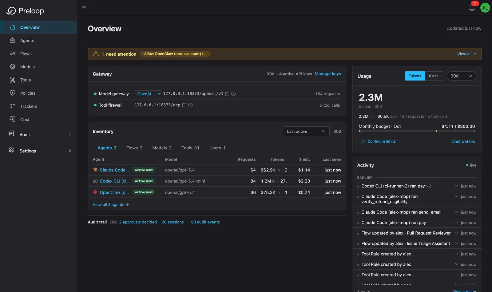
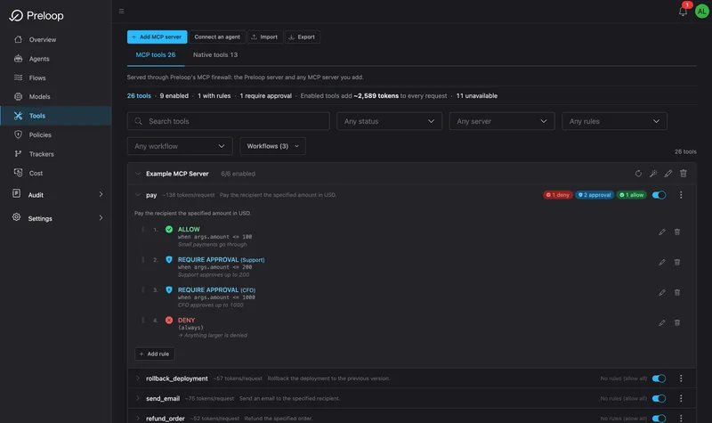
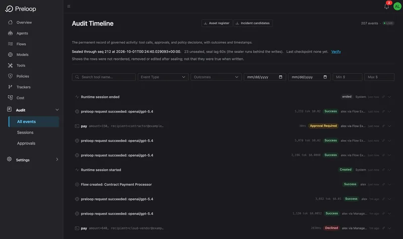

#  Preloop

[](https://github.com/preloop/preloop/actions/workflows/ci.yml)
[](https://github.com/preloop/preloop/releases/latest)
[](https://pypi.org/project/preloop/)
[](https://www.python.org/downloads/)
[](LICENSE)

**The open-source AI agent control plane.** See them, govern them, cut their cost.

Preloop is one self-hostable service that sits between your AI agents and everything they reach, so every tool call and every model call is governed, attributed, and visible. Four pillars:

- **MCP firewall.** Allow, deny, or require approval on any tool call.
- **AI model gateway.** OpenAI-, Anthropic- and Gemini-compatible ingress, with budgets, allowed-model lists, token accounting, and attribution.
- **Policy-as-code with human approvals.** YAML plus CEL. Approve from mobile, watch, Slack, Mattermost, email, or the CLI.
- **Runtime session observability.** One timeline per session: tool calls, model calls, policy, approvals, spend, outcomes.

Onboard existing agents with one command. Talk to long-running ones from the console, phone, or watch. Deploy event-driven automations when GitHub, GitLab, Bitbucket Cloud, Jira, or a webhook fires. Works with OpenClaw, Claude Code, Codex CLI, Cursor, Gemini CLI, Hermes, OpenCode, Windsurf, and any MCP-compatible agent.

Flow presets can review pull requests, implement issues, scan for vulnerabilities, collect machine evidence for CRA- and EU AI Act-style reviews (SBOM verify, exploit check); Runtime Observability keeps the session timeline next to it. That is not a conformity assessment, certification, or legal advice. Presets: [security audit presets](docs/guide/flows/security-audit-presets.md).

Your first five minutes, start to finish:

```bash
# 1. Install the CLI (macOS / Linux)
curl -fsSL https://preloop.ai/install/cli | sh

# Windows (PowerShell): irm https://preloop.ai/install/cli.ps1 | iex
# Details: docs/windows-cli.md

# 2. Connect it to a control plane
preloop signup                                # Preloop Cloud (fastest), or
preloop login --url http://localhost:3000    # your self-hosted instance

# 3. Bring local agents under governance
preloop agents discover
```

`preloop agents discover` finds local agent configs, imports representable MCP servers and model metadata, mints managed credentials, and rewrites supported agents so tool calls go through the **MCP Firewall** and model traffic through the **Gateway**. For Talk (operator commands), the CLI can install the runtime plugin (`preloop agents install-plugin`, or `preloop claude` for Claude Code). The plugin is what keeps the control channel connected.

[Pi and DeepSeek Harness](runtime-plugins/harness-preloop/README.md) support CLI onboarding, gateway routing, native tool approvals, active-session remote control, and ephemeral flows. Onboard with `preloop agents onboard Pi --approvals` or `preloop agents onboard "DeepSeek Harness" --approvals`.

<p align="center">
  
</p>

## Watch it work

Onboarding, the MCP firewall, human approvals, and cutting session cost. Recorded against a real stack, no slideware.

<p align="center">
  <a href="https://www.youtube.com/watch?v=Y_geb2Or8zM&list=PLr2Jp0c-Qn2hoYL3aRZGUtBjTCVygWIXt">
    
  </a>
</p>

<p align="center"><a href="https://www.youtube.com/watch?v=Y_geb2Or8zM&list=PLr2Jp0c-Qn2hoYL3aRZGUtBjTCVygWIXt"><b>Watch the full playlist &rarr;</b></a></p>

Guides: [docs.preloop.ai](https://docs.preloop.ai). Start here: [onboard local agents (60s)](https://docs.preloop.ai/quickstart-cli/).

A run in progress is not out of reach. [Operator notes](docs/guide/operator-notes.md) let an identified human (or, with an opt-in tool, another agent) steer a running agent: the note is delivered at the next turn boundary through the gateway or a hook, costs nothing when there is none, and is recorded with who sent it. Send one from the console, the API, or `preloop notes send`. The [account kill switch](docs/guide/account-kill-switch.md) goes the other way: it blocks gateway and tool traffic, freezes pending approval deadlines, and requests termination of active managed flow executions, with audited staged recovery.

Finished runs stay searchable, in the console, from `preloop sessions search`, and by an agent that has been given the `search_sessions` tool. Keyword ranking is always available, semantic and hybrid ranking are a per-account opt-in, every search is audited, and a question worth repeating can be [saved under a name](docs/guide/session-saved-searches.md). Two exports turn the agent inventory and the failure record into files an auditor can read: [DORA: the AI-agent slice](docs/guide/dora-agent-slice.md). They feed an Art. 8 inventory and an Art. 28 register, and list Art. 17 incident candidates. Classification stays with your firm, and Preloop covers the agent slice of the ICT estate only.

## What you get

Jobs teams otherwise buy from several vendors, in one Apache 2.0 stack:

| Capability | What it does | Alternatives |
|---|---|---|
| **MCP Firewall** | Govern every tool call. Allow, deny, require approval, require justification. YAML + CEL. | MintMCP, Lunar.dev MCPX, TrueFoundry |
| **AI Model Gateway** | OpenAI-, Anthropic- and Gemini-compatible. Budgets, allowed-model lists, token accounting, attribution. | Portkey, Helicone, LiteLLM, Kong AI |
| **Flows** | Start an agent when a tracker, webhook, or CI job fires, with the same firewall, approvals, and cost. `preloop flow trigger`. | Custom CI glue, AgentCore Runtime |
| **Cost & Budgets** | Spend by model, agent, session, API key, flow, and user, including usage you import when the model never hits the gateway, such as [GitHub Copilot seats and premium-request spend](docs/guide/copilot-usage-import.md). | FinOps dashboards, vendor billing exports |
| **Human Approvals** | Mobile, watch, Slack, Mattermost, email, webhook, or `preloop approvals`. Native `Bash`/`Edit`. Agents can `ask_user`. | Custom Slack bots, Peta Desk |
| **Runtime Observability** | One session timeline: tool calls, model calls, policy, approvals, spend, outcomes. | AgentOps, Langfuse, LangSmith |
| **Evidence packs** | Apache flow presets write `result.json` plus an evidence directory for CRA / AI Act-style work. Not a certification. | Custom GRC folders |

Upstream providers include OpenAI, Anthropic, Google, [Amazon Bedrock](docs/guide/providers/bedrock.md), [Azure OpenAI](docs/guide/providers/azure-openai.md), [Alibaba Cloud Model Studio (Qwen)](docs/guide/alibaba-model-studio.md), DeepSeek, Mistral, Moonshot (Kimi), Z.ai (GLM), OpenRouter, and any OpenAI-compatible endpoint you configure. [Reviewed model pricing](docs/guide/model-price-refresh.md) distributes verified tariffs to gateway, API, and worker processes, and Alibaba tariffs preserve regional and cache-policy differences. The weekly review preset prepares tested pricing PRs after you bind its repository and model; historical repricing is a separate operation. Models or billing modes without verified rates remain visibly unpriced. [OTLP export](docs/guide/observability-otlp.md) is off by default; turn it on and governed model calls and MCP tool calls emit OpenTelemetry GenAI spans to any OTLP backend, without replacing the spend ledger.

```text
AI Agent → Preloop → [Policy]  → Allow / Deny / Require Approval → Execute
                   → [Gateway] → Budget + attribution             → Model
```

[Bitbucket Data Center 10.2 LTS](docs/guide/bitbucket-data-center.md) is available as an opt-in, fixture-tested provider for manual PAT discovery and pull request review. It is off by default; live certification and execution/publication routing are separate.

Connect GitHub, GitLab, Bitbucket Cloud, or Jira as flow triggers and issue tools ([Bitbucket Cloud setup](docs/guide/bitbucket-tracker.md), [Bitbucket and Jira quickstart](docs/guide/bitbucket-jira-quickstart.md)). Automations ship as presets, including the [Issue Triage Assistant](./docs/guide/flows/issue-triage.md), [Pull Request Reviewer](./docs/guide/flows/pull-request-review.md) and [Observe / Eval](./backend/presets/003-observe-eval.yaml). Or write your own. A flow can also start another flow of the same account as a child of itself, and the execution page shows the resulting tree: [flow delegation](docs/guide/flows/flow-delegation.md). [Automated issue implementation](docs/guide/flows/durable-implementation-feedback.md) can resume its PR branch and native agent conversation after review or CI feedback, with durable turn budgets and current-head gates. A finished run whose PR publication was not recorded can be recovered by explicitly selecting and verifying its published PR and branch; when the native checkpoint is unavailable, follow-up requires acknowledgment that it starts a fresh conversation.

CI can trigger a flow too: the [`run-flow` GitHub Action](docs/guide/flows/github-actions.md) (`.github/actions/run-flow`) starts a flow from a workflow job, streams the execution log, and fails the job on the execution's verdict. Where the agent container runs is your choice. [Private runners](docs/guide/runners/quickstart-linux.md) run it on your own machines over an outbound WebSocket, with no inbound ports: `preloop runner fg` holds several executions at once (default 2), and `--once --ephemeral` is a one-shot runner that exists for a single CI job.

### Policy-as-code

```yaml
version: "1.0"
metadata:
  name: "Production Safeguards"

approval_workflows:
  - name: "deploy-approval"
    timeout_seconds: 600
    required_approvals: 1
    async_approval: true

tools:
  - name: "bash"
    source: mcp
    approval_workflow: "deploy-approval"
    justification: required
    conditions:
      - expression: "args.command.contains('deploy') && args.command.contains('production')"
        action: require_approval
```

Ship it with `preloop policy apply <file>` (`validate` / `diff` / `export` also exist).

<p align="center">
  <a href="frontend/public/assets/screenshots/quickstart/dark/dashboard.png"></a>
</p>

<div align="center">
  <a href="frontend/public/assets/screenshots/quickstart/dark/rules_configured.png"></a>
  <a href="frontend/public/assets/screenshots/quickstart/dark/audit_page.png"></a>
</div>

Talk details for OpenClaw, Hermes, and Claude Code: [OpenClaw](https://docs.preloop.ai/integrations/openclaw/), [Hermes](docs/guide/hermes.md), [runtime adapters](https://docs.preloop.ai/integrations/agent-control-runtime-adapters/).

## Getting started

The CLI is a client. It talks to a control plane: [Preloop Cloud](https://preloop.ai) or a stack you run.

**Cloud (fastest)**

```bash
curl -fsSL https://preloop.ai/install/cli | sh
preloop signup
preloop agents discover
```

**Self-host (Docker Compose, data stays on your machine)**

```bash
curl -fsSL https://preloop.ai/install/oss | sh
curl -fsSL https://preloop.ai/install/cli | sh
preloop login --url http://localhost:3000
preloop agents discover
```

Console: `http://localhost:3000`. The CLI stores the instance URL in `~/.preloop/config.yaml`. Without `--url` or `PRELOOP_URL`, it defaults to `https://preloop.ai`. `preloop auth logout` revokes this machine's login and clears it; `preloop auth logout --all` also revokes every other CLI and console session; `preloop auth sessions list` and `revoke <id>` manage individual CLI logins. Command list: [CLI authentication](cli/README.md#authentication).

Public TLS, SMTP (approvals, invites, password resets), upgrades, and Kubernetes: [Install the OSS stack](https://docs.preloop.ai/self-hosting/installation/), [TLS](https://docs.preloop.ai/self-hosting/tls/), [Upgrading](https://docs.preloop.ai/upgrade/). Helm chart: [`helm/preloop`](helm/preloop) ([private cluster](helm/preloop/README.md#private-cluster)). Docker Compose and Helm are the supported install surfaces; this repository does not ship Terraform modules.

What stays stable across those upgrades, and how a breaking change is announced, is the [compatibility policy](docs/compatibility.md).

Production self-host: `SECRET_KEY` is required or the app refuses to start, and the Helm chart refuses to install while `environment.jwtSecret` is empty or a placeholder (see [helm/preloop/README.md](helm/preloop/README.md#jwt-authentication)). The development `docker-compose.yml` ships development-only credential defaults; override them with a `.env` file (start from `.env.example`). Telemetry is a daily pseudonymous version check-in; set `PRELOOP_DISABLE_TELEMETRY=true` to disable. Event list: [SECURITY.md](SECURITY.md#telemetry).

## Working in this repository

This file is the product intro. It is not the architecture and not the coding contract.

| If you need | Read |
|---|---|
| How the system fits together | [ARCHITECTURE.md](ARCHITECTURE.md) is the map. Read one chapter under [`docs/architecture/`](docs/architecture/) for the subsystem you are changing. Do not load every chapter "for context." |
| Commands, DB/CRUD rules, Lit frontend | [AGENTS.md](AGENTS.md) |
| PR process | [CONTRIBUTING.md](CONTRIBUTING.md) |
| Operator and client guides | [docs.preloop.ai](https://docs.preloop.ai) |
| Compatibility of public surfaces | [docs/compatibility.md](docs/compatibility.md) |
| Policy examples | [`backend/presets/`](./backend/presets/) |

Do not load this README plus ARCHITECTURE.md end-to-end "for context." Pick the row above.

## Open-source alternative to AWS Bedrock AgentCore

Same core jobs (runtime, gateway, identity, observability, policy), vendor-neutral and self-hostable. Full comparison: [preloop.ai/vs/aws-agentcore](https://preloop.ai/vs/aws-agentcore).

| | Preloop | AWS Bedrock AgentCore |
|---|:---:|:---:|
| Open source (Apache 2.0) | Yes | No |
| Self-hostable (VPC / on-prem) | Yes | No |
| Policy-as-code (YAML + CEL) | Yes | Limited |
| MCP-native tool governance | Yes | Partial |
| Human approvals (mobile, Slack, webhook) | Yes | Limited |
| Onboard existing local agents (`preloop agents discover`) | Yes | No |

Also compare: [LiteLLM](https://preloop.ai/vs/litellm), [Portkey](https://preloop.ai/vs/portkey), [Helicone](https://preloop.ai/vs/helicone), [MintMCP](https://preloop.ai/vs/mintmcp), [Lunar](https://preloop.ai/vs/lunar), [Runlayer](https://preloop.ai/vs/runlayer), [Zenity](https://preloop.ai/vs/zenity).

## Editions

Unqualified **Preloop** is this repository (Apache 2.0, self-hosted). **Preloop Cloud** is the hosted service at [preloop.ai](https://preloop.ai). **Preloop Enterprise** is the commercial self-hosted edition.

Cloud is managed hosting. Cloud and Enterprise include support plans. Cloud billing owners can compare the available usage from the previous three completed months in Account settings before requesting a plan-change quote. Missing history is labeled explicitly; a change requires confirmation of its price, limits and effective date. Cloud plan limits do not apply to the open-source self-hosted edition.

Governance itself is open source: every model provider, flows, private runners, session search, operator notes, single-approver workflows and budgets scoped to the account, a flow, an API key or a managed agent all ship in this repository. What is commercial is the organizational layer on top of them: more than one approver, quorum, escalations, budgets scoped to a user or a team, budget notification routing, and users, teams and RBAC on one account. Cloud usage allowances and hosted credits are a separate thing from governance budgets.

| Feature | Open Source | Cloud / Enterprise |
|---|:---:|:---:|
| Users, teams, and RBAC on one account | No | Yes |
| Budgets scoped to a user or a team, budget notification routing | No | Yes |
| Multi-approver routing, quorum, escalations | No | Yes |

A self-hosted OSS instance is one operator per account. Public signup, if left on, creates a separate account, not a teammate. Invitations, users, teams, and permission roles ship with Cloud and Enterprise.

Enterprise licensing: sales@preloop.ai.

## Community

[Discord](https://discord.gg/P6nWSee4jv) for help, feedback, and the founder's build log.

## Contributing

See [CONTRIBUTING.md](CONTRIBUTING.md).

The [disposable capacity lab](scripts/capacity/README.md) measures authenticated MCP, model-gateway and execution-log workloads using local simulated providers.

## License

[Apache License 2.0](LICENSE). Copyright (c) 2026 Spacecode AI Inc.

Release assets carry signed Sigstore build provenance and checksums. See [verification instructions](./docs/release-verification.md).

Windows CLI release binaries pass a required Defender scan and ten-minute observation before publication. Optional VirusTotal scanning and SignPath Authenticode signing provide additional release checks; signing is pending. [windows-cli.md](./docs/windows-cli.md), [windows-code-signing.md](./docs/windows-code-signing.md), [code-signing-policy.md](./docs/code-signing-policy.md).

Free code signing provided by [SignPath.io](https://about.signpath.io/), certificate by [SignPath Foundation](https://signpath.org/).

Execution environment profiles and hosted checkpoint recovery are documented in [Environments and recovery](docs/guide/flows/environments-and-recovery.md).

Operators can enable verified SSH and GCP agent deployment from the console.
See [remote agent deployment](docs/operations/agent-deployment.md) for host-key
verification, dedicated cloud credentials, and proxy timeout configuration.

Cost links can carry an exact UTC `start_date` / `end_date` interval, with an
optional `account_id` context. The console displays a **Digest period** without
changing the saved preset. Account context is checked against the signed-in
account; switching accounts and authentication retain the requested window.
