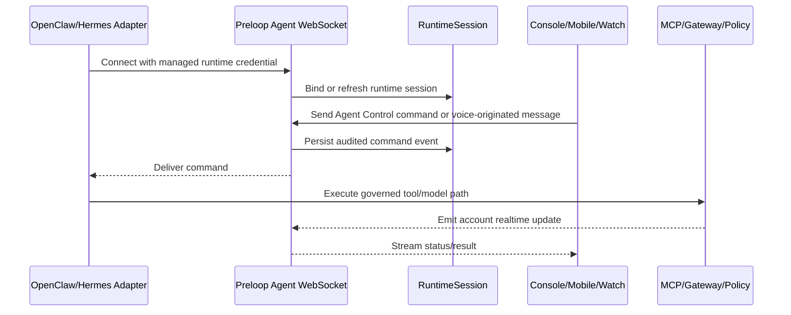

# Agent Control

Agent Control is the audited operator channel to managed agents such as OpenClaw and Hermes. This chapter covers the control WebSocket, CLI/desktop enrollment, and mobile/watch voice contact.

The control WebSocket runs authentication, heartbeat, command persistence and
disconnect cleanup in short worker-owned database sessions. Only frozen scalar
identity and copied command envelopes leave a worker; no ORM object crosses the
thread boundary. Idle sockets do not reserve database connections. Each socket's
DB phases are serialized, and cancellation drains its active worker before
another phase starts. Socket and NATS I/O happen after the session closes.

A nullable `managed_agent.control_connection_id` UUID records the current socket
generation independently of its durable runtime identity session. Every inbound
message and every delivery read/mark locks the managed agent, then checks the
current generation, active credential, active account/owner and agent lifecycle before
runtime or command writes. Suspending or decommissioning invalidates the
generation. Disconnect clears heartbeat, mode and the matching runtime binding
atomically only if it still owns that generation, including across API replicas.
Revoked sockets may clean up their own presence but cannot retire a replacement.
Runtime-session churn does not revoke the durable agent credential. The account
active check is a scoped read rather than a row lock, avoiding a new lock order
with account lifecycle operations; a suspension racing that read is rejected by
the next control unit.

PostgreSQL control transactions set local lock and statement timeouts (1.5s and
5s); pooled connections retain their normal settings afterwards. A failed inbound
transaction closes with code 1013 so the runtime can reconnect; replaced or
revoked connections close with code 4000 to avoid an eviction reconnect loop.
The engine's pool checkout timeout remains separately configured. Database
capacity errors during authentication remain operational failures.

Local delivery, reconnect replay and NATS callbacks use persisted account/agent
command envelopes, revalidating ownership before delivery and again before its
mark. Producers snapshot delivery identity and release their post-commit read
transaction before awaiting the guarded sender, so concurrent command requests
and in-session question notices leave pool capacity for delivery. Release refuses
pending caller writes instead of committing or discarding them. Replacement can occur between a completed read and socket I/O; that old
socket cannot subsequently acknowledge or mark the new connection's work.
Delivery remains at least once: adapters must deduplicate by stable command ID
before irreversible effects. No database lock is held across the network to
claim exactly-once execution. Unknown/peer command results are rejected and
repeated final results do not duplicate activity history. The server owns result
identity, source and role metadata even when the runtime supplies those keys.

Apply migration `20260912_control_connection` before deploying this code. Old
replicas do not enforce generation checks, so complete the application rollout
and reconnect old control sockets before relying on the new fencing guarantee.
Local registration serializes the database claim and registry handoff; eviction
close attempts have a one-second deadline so an unresponsive old socket cannot
hold unrelated handshakes indefinitely.

The disposable PostgreSQL acceptance suite is
`backend/tests/api/test_control_postgres_acceptance.py`. It uses real sockets and
a pool of two, an independent lock-holding session, separate managers, and local
synthetic credentials. Set `PRELOOP_DISABLE_TELEMETRY=true` and `DATABASE_URL` to a
migrated disposable PostgreSQL database (UTC), then run that file with pytest.

## Agent Control
*   **Purpose:** Agent Control gives autonomous agents such as OpenClaw and Hermes a single, audited channel for online presence, operator messages, status updates, interruption, and future voice-originated contact.
*   **Implemented Today:** Backend Agent Control exposes `WS /api/v1/agents/control/ws` for runtime-credential agent connections and `POST /api/v1/agents/{agent_id}/control/commands` for authenticated operator text commands. It authenticates the runtime principal, binds presence to the managed agent and runtime session, publishes command envelopes through NATS when available, falls back to local delivery, emits account-scoped realtime events, and accepts heartbeat/status/presence/event envelopes from agents. Operator commands are now persisted BEFORE delivery in the `agent_control_command` table (state machine: pending → delivered → acked, with failed/expired side states, TTL via `agent_control_command_ttl_seconds`); reconnecting agents receive undelivered commands in order with their original `command_id`s (runtime plugins should dedupe on `message_id`), and inbound `command_ack`/`command_result`/`command_error` envelopes mark acknowledgement.
*   **Related Implemented Surfaces:** Browser, mobile, and console clients can use account-scoped realtime topics over WebSocket. Runtime sessions, managed-agent records, model-gateway usage, approval events, and operator lifecycle actions already share account-scoped event routing.
*   **Scaffolded Today:** `account_realtime` defines normalized topics such as `runtime_sessions`, `managed_agents`, `gateway_activity`, `budget_health`, and `audit`; the WebSocket manager can filter broadcasts by account and topic; frontend runtime-session and managed-agent views subscribe to those topics. Mobile/watch clients have native voice UI scaffolds that can create operator text turns, but the end-to-end user experience still depends on runtime adapters and production hardening.
*   **Runtime Plugins (shipping):** Standalone open-source runtime plugins live in `runtime-plugins/` — `@preloop-ai/openclaw-plugin` (npm, TypeScript) and `preloop-hermes-plugin` (PyPI, Python) — and implement the `preloop.agent_control.v1` protocol: they read `preloop.control.control_ws_url`, connect with the durable runtime bearer token, own reconnect/backoff behavior, keep the WebSocket open, send heartbeat/status events, advertise capabilities, receive `send_message` command envelopes, acknowledge delivery, map operator messages into their own interactive runtime, and gate native tool calls through Preloop approvals (fail-closed by default). `preloop agents install-plugin <agent>` delegates installation to the runtime marketplace; `PUBLISHING.md` covers lockstep versioning. Existing enrollment can rewrite MCP and model traffic even when the runtime plugin is absent, but Agent Control is not enabled until that plugin is running inside the agent process.
*   **Desktop capability:** Hermes and OpenClaw read `$PRELOOP_DESKTOP_FILE` or `~/.preloop/desktop.json` and add two keys to the presence `capabilities` object. A parsed file whose `vnc.host` is exactly `127.0.0.1` sends `desktop: "vnc"` and `desktop_display` (the manifest `display`, typically `:99`); every other case, including a missing file or a missing key from another plugin, sends `desktop: "none"`. The VNC password file and the rest of the manifest (host, port, auth, browser) stay on the machine. The backend stores that envelope with the agent's presence and exposes `desktop` (`"vnc"`, `"rdp"`, or `"none"`) and `desktop_display` on the managed-agent API. Brokered viewing and RDP detection are not part of this signal.
*   **Claude Code Sidecar (prototype):** Claude Code has no in-process plugin API for message injection, so `@preloop-ai/claude-plugin` (`runtime-plugins/claude-preloop`) runs as a standalone sidecar daemon implementing the same `preloop.agent_control.v1` protocol. It reads `~/.claude/preloop-control.json` (its own file; `settings.json` stays reserved for Claude Code), drives sidecar-owned sessions through the Claude Agent SDK (streaming input for `send_message`, `resume` for persisted sessions, `interrupt()`), and reports presence/telemetry for interactive terminal sessions by tailing `~/.claude/projects/**/*.jsonl` (summaries only, no transcript upload). Interactive TUI sessions are observe-and-approve, not steerable mid-turn; targeting one resumes it headlessly. Tool approvals remain on the PreToolUse permission hook installed by `preloop agents onboard --approvals`; owned sessions load filesystem setting sources so the same hook fires there, and stopping the sidecar never ungoverns anything.
*   **Codex CLI Sidecar (prototype):** Codex CLI likewise has no in-process plugin API for message injection, so `@preloop-ai/codex-plugin` (`runtime-plugins/codex-preloop`, bin `preloop-codex-plugin`) runs as a standalone sidecar implementing `preloop.agent_control.v1` with `runtime: "codex"`. It reads `~/.codex/preloop-control.json` (its own file; `config.toml` and `auth.json` stay reserved for Codex). Owned threads are driven through `@openai/codex-sdk`: `start_new_session` calls `startThread` in `cwd` or `workspace_root`, a follow-up turn on an owned thread calls `thread.run`, an unknown `target_session_id` calls `resumeThread`, and `interrupt` aborts the in-flight run with an `AbortController` and answers `command_result` with a stopped marker (`status: "stopped"`). Presence for interactive sessions comes from tailing `~/.codex/sessions/**/*.jsonl` (summaries only). Advertised capabilities match the Claude sidecar except `worktree`. Tool approvals stay on the hook installed at `~/.codex/hooks.json` by `preloop agents onboard "Codex CLI" --approvals`. The sidecar does not set `approvalPolicy` to `never`, does not rewrite `config.toml` or `auth.json`, and stopping it never ungoverns anything (fail-closed). `codex_sandbox_mode` defaults to `workspace-write`; `danger-full-access` is refused unless `codex_allow_full_access` is also set.

### Runtime support

| Kind | Channel | New session | Notes |
| --- | --- | --- | --- |
| `hermes` | in-process plugin | yes | PyPI `preloop-hermes-plugin` |
| `openclaw` | in-process plugin | yes | npm `@preloop-ai/openclaw-plugin` |
| `claude_code` | sidecar | yes | `@preloop-ai/claude-plugin`, `~/.claude/preloop-control.json` |
| `opencode` | in-process plugin | yes | `@preloop-ai/opencode-plugin` |
| `pi` | harness plugin | no | text on an already-open session only |
| `deepseek` | harness plugin | no | text on an already-open session only |
| `codex` | sidecar | yes | `@preloop-ai/codex-plugin`, `~/.codex/preloop-control.json` |

*   **Target Protocol:** A managed agent opens a durable WebSocket using its runtime credential, sends runtime principal/session metadata, subscribes to account and agent-specific command topics, publishes heartbeat/status updates, and acknowledges command delivery. Server-side commands should be persisted and audited before delivery so reconnecting agents can recover missed instructions.
*   **Session Prompt Semantics:** Operator text sent through Agent Control is an auditable user/operator turn for the selected runtime session. It is not a hidden system prompt, policy override, or privileged tool instruction. Runtime adapters should inject it as the next user-facing instruction in the agent's normal conversation model, preserve the current session context when possible, record the originating surface in metadata, and continue routing any resulting tool calls or model calls through the MCP firewall, model gateway, and approval policies.
*   **In-Session Question Delivery:** When the `ask_user` or `request_approval` builtin raises a pending approval and the asking session's runtime has a live Agent Control connection, `preloop.services.ask_user_inband` also delivers the question into that session as an audited `send_message` turn (persisted in `agent_control_command`, logged as `agent_control_message` activity with `kind=preloop_question_notice`). The in-session turn is a notice with token-free deep links (`/console/approval/<id>` web, `preloop://approve/<id>` mobile) — never an answer channel: anything returned over the control WebSocket is agent output and is not accepted as the human's answer. Answers enter only through the governed approval endpoints, so the single approval record and its quorum/first-answer-wins semantics are preserved across surfaces.
*   **Security Boundary:** The channel uses the same runtime principal, subject-scoped governance, and API-key revocation model as MCP and gateway traffic. Commands that trigger tool use, model calls, or local side effects still flow through the MCP firewall, model gateway, or explicit approval policy rather than bypassing enforcement.

## Flow execution on a persistent agent

A flow can target a live managed agent instead of provisioning an ephemeral
container. The flow form stores `agent_config.execution_path = "persistent"`
and `agent_config.target_agent_id`. `create_executor_for_execution` selects
`AgentControlExecutor` for that config **before** private-runner pool
resolution. Missing `target_agent_id` fails at start with `AgentStartError`;
there is no fallback onto a hosted container.

### Envelope

The orchestrator already renders the flow prompt. The executor sends that
string as one audited `send_message` with `start_new_session=true`,
`input_mode=text`, and metadata:

| Key | Source |
| --- | --- |
| `source` | always `flow_execution` |
| `flow_id`, `flow_execution_id`, `flow_name` | execution context |
| `trigger_event_source` | trigger payload |
| `repository`, `ref` | trigger payload when present |
| `timeout_seconds` | the flow's timeout budget |
| `workspace` | checkout contract below. No credentials. |

`workspace.mode` is also a prompt placeholder (`{{workspace.mode}}`).
Ephemeral container runs render `ephemeral`. Persistent runs render
`persistent_checkout` or `clone_less`.

### Workspace

When `git_clone_config.enabled` is true and the trigger or clone config
names a repository, `workspace` is:

| Key | Meaning |
| --- | --- |
| `mode` | `persistent_checkout` |
| `repository_url` | credential-free clone URL |
| `repository_slug` | `owner/repo` path under the sidecar `workspace_root` |
| `default_branch` | repository default branch |
| `ref` | branch the sidecar falls back to |
| `fetch_ref` | pull or merge request ref to fetch first, when present |
| `sha` | commit to check out detached, when the trigger has one |
| `pr_number` | pull request or merge request number, when present |

Clone depth and submodules are not part of this contract. The container
clone path does not take them from `GitCloneConfig` either. A config with
more than one repository stays `clone_less`: one workspace object cannot
name every checkout the container would make.

`repository_url` never contains a password. An `ssh://git@host/...` URL
keeps the `git` user. Other schemes are dropped and the run is
`clone_less` when no safe URL remains. A repository whose name cannot be
a safe checkout directory name (unsafe or missing `repository_slug`) also
stays `clone_less`: a persistent checkout is a directory named by the slug.

When clone is disabled, or no repository can be resolved, `workspace` is
`{mode: "clone_less"}`. The review reads the diff from the tracker.

The Claude sidecar (`runtime-plugins/claude-preloop`) handles
`persistent_checkout` as follows. The Codex sidecar implements the same
contract separately.

* Ensure `<workspace_root>/<repository_slug>` exists. Clone once, then
  fetch on that same run and on later runs. Fetch tries `fetch_ref`, then
  `sha`, then `ref`. The commit is checked out detached.
* `spawn_worktree` creates a worktree after that checkout and runs the
  turn there.
* Git operations on one repository directory are serialized in-process.
  Eviction takes the same lock and skips a directory whose turn is still
  running.
* A dirty tree fails the command with `command_error`. The sidecar does
  not `reset --hard` or `clean` it. A persistent turn that leaves
  uncommitted edits with `spawn_worktree: false` fails the next run on
  that repository; use a worktree or commit/clean before the next turn.
  Ownership is `preloop.managedcheckout` in the repository's git config,
  so a restart still recognises a tree the sidecar checked out.
* `ssh://git@host/...` is a valid clone URL. A password in the URL is
  refused. `protocol.ext.allow` and `protocol.file.allow` are `never`.
* The resolved path is `metadata.workspace_path` on `command_result`
  (the ack handler does not store a payload) and on an
  `event/session_activity`.
* `workspace_repositories_max` (default 20) evicts the least recently
  used clean checkout. Dirty directories are kept.
* `workspace_fetch_timeout_ms` (default 120000) bounds fetch and clone.

The envelope shape is the same one runtime plugins already accept (`text`,
`metadata`, `input_mode`, `session_mode`, `start_new_session`, optional
`cwd`). Persist-before-deliver is unchanged: the command row is written, then
local WebSocket or NATS delivery runs.

### Binding

The session reference is `control:{managed_agent_id}:{command_id}`. The
command id is stored on the execution under
`trigger_event_details._agent_control` (with the live and history session
ids) so stop and status can recover both ids without a schema migration.
Trigger bodies cannot set `_agent_control`; it is a reserved key.

### Status mapping

| Agent Control command | Executor `AgentStatus` | Flow execution |
| --- | --- | --- |
| `pending` or `delivered` | `RUNNING` | stays running |
| `acked` without a result | `RUNNING` | stays running |
| `acked` plus `command_result` (success) | `SUCCEEDED` | `SUCCEEDED` |
| `command_error`, `failed`, or `expired` | `FAILED` | `FAILED` |
| operator/timeout `stop` | `FAILED` (`error=stopped`) | `STOPPED` or timeout failure |

A repeated final `command_result` / `command_error` does not flip a terminal
command or duplicate session activity.

The container confirmation contract (`PRELOOP_AGENT_EXEC_START` plus success
sentinel / `result.json`) does not apply: this path never emits the start
marker, so a successful `command_result` is sufficient.

### Timeout and stop

The orchestrator `TimeoutBudget` still bounds the poll loop. When the budget
expires it calls `AgentControlExecutor.stop`, which sends `send_message` with
`interrupt: true` and `session_mode: current` (no tracking-session UUID).
That interrupts the agent's **current** session — the most recently owned
plugin session — which is usually this flow but can be a later operator
turn if one started. Native session ids from ack/presence are not persisted
on the binding yet. The bound command is marked `stopped` only after that
interrupt is delivered; a failed interrupt leaves the command non-terminal
so the operator can see the remote session is still live. The execution
itself still fails with the timeout message.

Start refuses (classified `runner_error`) when the target is missing,
inactive, not an allow-listed Agent Control kind, has no verified control
config, or has a stale heartbeat (the same three-heartbeat window the
console uses for `plugin_connected`). Allow-listed kinds that only accept
text on an already-open session (currently Pi and DeepSeek) also fail at
start: persistent dispatch always sends `start_new_session=true`. The
operator endpoint uses the same
`CONTROL_NEW_SESSION_UNSUPPORTED_KINDS` set.

### Not covered yet

* The Codex sidecar implementing this same persistent workspace contract.
  Codex is already on the Agent Control allow-list, and CLI onboarding writes
  `~/.codex/preloop-control.json`.

## Managed CLI/Desktop Agent Enrollment
*   **Discovery Entry Point:** `preloop agents discover` can stay read-only (`--json`, `--no-onboard-prompt`) or hand off interactively into managed enrollment, with `--yes` available for auto-onboarding.
*   **Shared Enrollment Engine:** `preloop agents enroll <agent>` and discovery-triggered onboarding both create or reuse a managed runtime identity, import representable MCP servers, mint a durable credential, back up the local config, and rewrite supported local endpoints to Preloop-managed MCP and gateway URLs. For Agent Control, the CLI writes the `preloop.control` contract and can delegate installation to runtime-native plugin managers, but it does not itself own the long-lived Agent Control WebSocket or execute operator commands.
*   **OpenClaw Coverage:** The current OpenClaw adapter supports legacy and newer config locations, JSON5 parsing, gateway-backed model rewrites, and conservative import of command-backed MCP entries such as `mcporter` when an upstream URL can be inferred safely.
*   **Hermes Coverage:** The Hermes adapter discovers `~/.hermes/config.yaml`/`.yml` or installed-but-unconfigured Hermes markers, preserves existing `mcp_servers`, adds a managed `preloop` HTTP MCP server, rewrites supported model configuration to Preloop's `/openai/v1` gateway, and can import provider-specific environment keys or ChatGPT/Codex OAuth material when present. Onboarding, offboard, restore, and `install-plugin` restart the Hermes gateway; on Linux they also print systemd user units named `hermes-*`. Operational recovery (systemd-first stop, config-path diagnosis) is in [Hermes: onboarding, rollback, and systemd recovery](../guide/hermes.md).
*   **Credential Boundary:** OpenClaw model credentials may be declared inline under `models.providers` or indirectly through `auth.profiles`; the enrollment path imports model metadata either way, but profile-backed provider secrets may still require manual configuration inside Preloop.
*   **Durable Identity:** `ManagedAgent.agent_kind` is now stored alongside `session_source_type` so operator UX and reporting do not depend on an active runtime session to recover the agent family.
*   **Explicit Model Association:** Onboarding now persists direct managed-agent to AI-model bindings instead of inferring one configured model indirectly from `AIModel.meta_data`.

## Mobile and Watch Voice Contact
*   **Implemented Today:** iOS, watchOS, and Android clients are documented and implemented around approval review, push notifications, QR pairing, and WebSocket-driven approval updates.
*   **Implemented Web Voice:** The web console Agent Control composer prefers browser-native `SpeechRecognition` and `speechSynthesis`, then falls back to server STT/TTS endpoints backed by speech-capable `AIModel` rows when browser audio APIs are unavailable.
*   **Scaffolded Native Voice:** iOS/watchOS and Android contain native STT/TTS or dictation scaffolds that can capture a user turn and call the Agent Control command surface, but production behavior depends on backend availability, managed-agent lookup, and OpenClaw/Hermes runtime adapters being online.
*   **Planned Voice Path:** Mobile/watch voice should start as a native app feature using vendor STT/TTS APIs, then post normalized operator messages into the same runtime session and Agent Control channel used by the console. The server remains the source of truth for transcript, command intent, approval requirements, and delivery state.
*   **Siri Constraints:** Siri Shortcuts and App Intents can launch a predefined Preloop action, capture structured parameters, and hand the user into the app. They should not be treated as a general always-listening background transport for arbitrary agent conversations.
*   **Google Assistant Constraints:** Google Assistant/App Actions can deep link into Android flows and pass structured intent data where supported, but arbitrary background agent chat or cross-app streaming is not a dependable control surface. Android should hand off to the Preloop app before sending audited commands.
