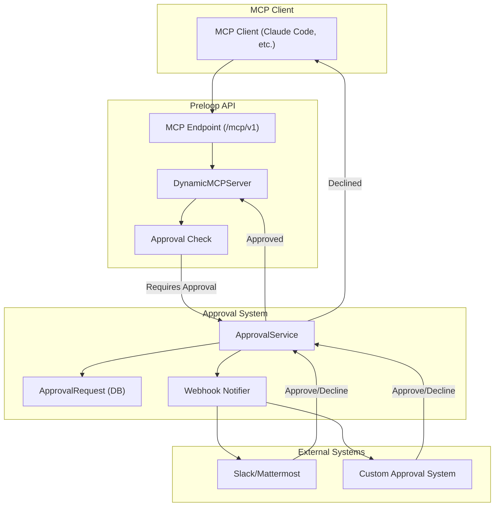

# Tool Configuration and Approval Workflow

Tool configuration records which tools are enabled and whether they need a human in the loop. This chapter covers approval workflows, the permission-check path for native tools, and `ask_user`.

## Tool Configuration and Approval Workflow

Preloop includes comprehensive infrastructure for managing tool configurations and implementing human-in-the-loop approval workflows for sensitive tool operations.

### Tool Configuration Management

**Database Models:**
- **`ToolConfiguration`**: Defines which tools are enabled for an account, their configuration parameters, and approval requirements
  - Links to an optional `ApprovalWorkflow` for tools requiring human approval
  - Supports both default (built-in) and proxied (external MCP server) tools
  - Stores tool-specific configuration in JSONB format

- **`ApprovalWorkflow`**: Defines rules for when and how tool executions require approval
  - Configurable approval modes: manual, auto-approve, auto-reject
  - Optional webhook integration for external approval systems
  - Supports workflow-specific settings (e.g., timeout duration, required approvers)

### Approval Workflow Architecture

**Approval Flow:**
1. MCP client initiates a tool call through the `/mcp/v1` endpoint
2. `DynamicMCPServer` checks if the tool requires approval via `_check_approval_required()`
3. If approval is required:
   - `ApprovalService.create_and_notify()` creates an `ApprovalRequest` record
   - Webhook notifications are sent to configured channels (Slack, Mattermost, custom endpoints)
   - The service waits for approval with configurable timeout
4. Approver reviews request and responds via:
   - Public approval API endpoint (`/approval/{request_id}/decide`)
   - Direct API call to Preloop
5. On approval, tool execution proceeds; on decline, error is returned to client

**Approval links.** Emitted links point at the console SPA route `/console/approval/<id>` (token-free for in-session agent notices; email/webhook links append `?token=` so a signed-out recipient can still be answered through the public token endpoints). A bare `/approval/<id>` is served by a backend shim that redirects to the console page, keeping previously emitted links working. Every lifecycle transition is persisted as an `ApprovalEvent` (creation, per-channel notification fan-outs with recipients, opens, votes with actor and channel, escalations, AI/bypass resolutions, expiry) and rendered as a workflow-history timeline on the console approval page and the public token page.

**API Endpoints:**
- `GET /api/v1/tool-configurations` - List all tool configurations for account
- `POST /api/v1/tool-configurations` - Create new tool configuration
- `PUT /api/v1/tool-configurations/{id}` - Update tool configuration
- `DELETE /api/v1/tool-configurations/{id}` - Delete tool configuration
- `GET /api/v1/approval-workflows` - List approval workflows
- `POST /api/v1/approval-workflows` - Create approval workflow
- `GET /api/v1/approval-requests` - List approval requests
- `GET /api/v1/approval-requests/{id}/history` - Workflow-history timeline for one request (events for request creation, per-channel notification fan-outs, opens, votes with actor, escalations, resolution/expiry)
- `GET /approval/{id}/data` - Public endpoint for getting approval request details (token-based; includes the same timeline without actor identities)
- `POST /approval/{id}/decide` - Public endpoint for approval responses (token-based)
- `POST /api/v1/agents/permission-check` - Lets an onboarded agent raise an approval for one of its **native/built-in** tool calls (not just MCP tools), authenticated with the agent's managed-runtime credential. It reuses `ApprovalService.create_and_notify` → `wait_for_approval` and blocks until decided, returning `{"decision":"allow"|"deny","reason","request_id","timed_out"}` (deny is the safe default). `timed_out: true` marks an expired approval. It remains a deny in CLI and runtime adapters, including with fail-open enabled; it must not become a local prompt that could bypass a required central approval. Transport failures and timeouts fail closed by default. Explicit fail-open applies only to transport/timeouts and HTTP 5xx availability failures; HTTP 4xx, malformed replies, and invalid configuration always block. The request's non-sensitive originating adapter travels as a `_preloop_source` marker inside `tool_args` so approver surfaces can distinguish e.g. a Cursor-originated `Write` from a Claude Code one without a schema migration. A client `deny` is honoured before native access rules so a Preloop allow cannot widen the host agent's policy. Rules then run before the hook's `client_decision` allow is honoured, and a matching rule wins (a blocked tool is denied without creating an approval). Only scoped rules whose stored `source` is `agent` or absent are honoured, so per-agent MCP rules named like native tools do not fire.

**Repository identity on the permission hook.** The CLI hook observes its own `cwd` and resolves the repository it sits in before calling the endpoint: `git rev-parse --show-toplevel`, then `git remote get-url origin`, normalized to `host/owner/repo` with scheme, userinfo, credentials, a trailing `.git` and a trailing slash stripped (the host is lowercased; the owner and repository keep their case). This is a trusted observation of the hook's working directory, not a policy input — it adds no repository or path scope to rule evaluation. The endpoint stores it as a `_preloop_repository` marker beside `_preloop_source`, so approval cards can name the repository the call ran in. Native-hook approvals store the marker on the approval request; they do not write a tool-call activity in this slice — the timeline chip renders when a tool-call activity's metadata carries the marker. Identity is only ever derived from `cwd`, never from tool arguments, because MCP paths are caller-supplied. A work tree with no `origin`, and an origin that is not a host/owner/repo identity (a local path or a `file://` remote), is recorded as `no_remote` with an empty remote; outside a git work tree, or when git does not answer within a 500 ms budget, the field is omitted and the call proceeds (fail open). Linked worktrees resolve to the worktree root, and a nested `cwd` carries the path relative to that root.

**Agent questions (`ask_user`).** Beyond allow/deny gating, the built-in `ask_user` MCP tool lets an agent ask the operator a question with multiple-choice `options` and/or a free-text answer, routed through the same approval workflow, notification, and audit pipeline. The question payload (`is_question`, `question`, `options`, `allow_free_text`) rides in the approval request's `tool_args` JSONB (no schema migration) and is surfaced on `ApprovalRequestResponse` as computed fields. The operator's reply is submitted via the same decision endpoints, where `ApprovalDecision` now accepts `selected_option`/`answer_text` (precedence: `answer_text` > `selected_option` > `comment`); the resulting text is returned to the agent as the tool result. Mobile/watch render options as buttons plus an answer field. When the question was resolved through a synchronous approval, `ask_user`'s return carries an approval audit trailer — `[approval_id: ...; answered_by: ...; answered_at: ...; status: ...]` — so an agent transcribing the human's decision (e.g. interactive waiver collection in the security-audit presets) can cite the governed approval record instead of asserting one. `answered_by` is resolved to the approver's email/username (raw id only as fallback); the metadata is scoped to the current `require_approval` call (cleared on entry, consumed once) so a stale approval can never be misattributed to a later question, and runs without an approval record keep the legacy return format unchanged.

**Approval window and parked executions.** How long a human has is a
setting, not a constant. `resolve_approval_window` (`services/approval_window.py`)
picks the most specific of: the `timeout_seconds` argument passed to
`ask_user` / `request_approval`, the running flow's `approval_window_seconds`,
the approval workflow's `timeout_seconds`, and
`settings.approval_default_window_seconds` (300, unchanged for interactive tool
calls). Every candidate is clamped to at least 60 seconds and at most the
account cap (`account.meta_data["approval_window_max_seconds"]`, which may only
tighten the 30 day deployment ceiling), and the resulting `expires_at` follows
it.

A window measured in days cannot be waited out in a container. When
`should_park` is already true at request creation (the window is longer than
`settings.approval_park_after_seconds`, 90 seconds), the execution is parked
immediately: `park_request_id` is written before the tool result is returned,
the orchestrator releases the container and sets `WAITING_FOR_HUMAN`, and the
tool call returns a `parked_for_human` result telling the agent it will resume
when the human answers. That park is a row write, so it stands even if the
tool result never reaches the agent. Windows at or under the threshold keep
the short in-process wait and only park if that wait elapses with the request
still pending. A parked run holds no container, no runner and no worker, and
the flow's `timeout_seconds` budget is paused (`parked_compute_seconds`
records the agent time already spent, and the resumed run gets the remainder).
An execution that ends failed, cancelled, or timed out cancels any approval
requests it still holds as pending, with a reason, so the console does not
show a question whose answer can no longer reach a run.

The decision resumes it. Every resolution path funnels through
`ApprovalService.update_approval_request`, which claims each parked execution
with a single conditional UPDATE (so a decision that arrives twice resumes once)
and creates a new execution carrying `_resume` plus the answer, exactly like the
PR-comment continuation. Harnesses with native session resume (Claude, Codex,
Gemini, OpenCode) continue the same session; others restart with the answer in
`payload.answers.<request_id>`. No harness can inject a value as the return of a
tool call in a session that was killed, so the answer arrives as the next turn,
naming the request id and repeating the question. An expired window resumes the
run with an explicit `expired` answer so the agent finishes gracefully rather
than the platform reporting a missing result. `ExecutionMonitor` sweeps parked
rows once a minute for expiry, for decisions whose resume dispatch was lost, and
for the 50 percent and 90 percent window reminders.

**Structured answers (`input_schema` / `items`).** A question that needs more than a word gets a shape instead of a text box. Both `ask_user` and `request_approval` accept an `input_schema` (a documented JSON Schema subset: `string`, `number`, `boolean`, `enum`, `array` of enums or of objects, `object` with named properties) and `items` (the rows the question is about: `id`, `title`, `description`, optional `severity` and `badges`). Both are normalized and validated when the tool is called, so a malformed schema fails at the source rather than in the browser. Extra keys on item rows are dropped (and recorded in `tool_args.dropped_item_keys`); they do not refuse the question. Item `id` values longer than 200 characters are refused by name. `severity` is display metadata: known values are lowercased, unknown values pass through. An enum is cross-checked against item ids only when at least one value overlaps; a plain multi-select next to a separate item table is allowed. The console renders the schema as a form (`frontend/src/components/answer-form.ts`): an item array becomes a table with a checkbox and per-row fields, booleans become switches, enums become radios or a select, scalars become typed inputs. The filled-in form is submitted as `ApprovalDecision.answer`, validated again server-side (422 with per-field `{path, message}` errors), stored in the new `approval_requests.structured_answer` JSONB column, and returned to the agent as JSON (`{"status", "answer", "answer_text", "approval_id", "answered_by", "answered_at"}`). Fields marked `x-autofill: author | date` are never typed by a human: the client drops them and the server stamps them from the decision record, so attribution stays a platform fact. Requests carrying a form are excluded from batch approval on both the client and the `POST /approval-requests/batch-approve` endpoint, because one shared comment cannot fill several forms. The legacy `options` / `allow_free_text` path is unchanged for callers that do not pass a schema; the mobile apps read the same `question_schema` / `question_items` / `has_answer_form` fields and can post `answer` when they add form rendering. A parked resume carries the same validated JSON in the `_answers_prompt` block, because there is no in-process tool result to return it on.

**Managed-agent linkage:** `ApprovalRequest` carries optional `managed_agent_id`, `runtime_session_id`, and `managed_agent_name` fields, populated from the runtime token context so approval surfaces can show which agent is asking. The endpoint and these identity columns are part of the open-source core. The per-agent native-tool interception adapters (Claude Code, Codex CLI, Cursor, OpenCode, OpenClaw, Hermes) and any future central per-agent/global policy UI live in Preloop Enterprise / the CLI.

**Workflow resolution.** Every account gets a default approval workflow seeded at signup with the account owner as approver (a startup repair pass heals legacy defaults and seeds accounts that missed it). Operators can additionally pin a specific approval workflow per managed agent from the Console's agent detail view (Tools & Governance → Native tool approvals); the pin is stored in the agent's subject-governance config (`approval_workflow_id`) and wins over the account default when the permission-check endpoint resolves a workflow.

**Account governance defaults.** `GET/PUT /api/v1/account/governance-defaults` stores account-wide native tool-approval defaults in the account's subject-governance metadata. Per-agent settings resolve through an explicit chain: explicit per-agent value → account default → enforce (fail-closed). Overrides are bidirectional: an agent can opt out of a permissive account default or relax a strict one, and the defaults response lists the per-agent override ids so the Console (Tools view: account panel; agent detail: inherit/override controls) can render effective state without N+1 lookups. When no native access rule matches, those defaults still decide whether the call is recorded and sent to a human.

**Local decision mirroring.** The CLI permission hooks compute a `client_decision` that mirrors, never widens, the host agent's own policy before raising an approval. The permission-check endpoint honours a client deny before native access rules for the same reason. Claude Code mirroring follows Claude's precedence (bypassPermissions → deny rules → ask rules → acceptEdits → allow rules → safe reads → ask); workspace `Write`/`Edit` in default permission mode deliberately stays "ask" because stock Claude Code prompts for them, so auto-allowing would swallow approvals the operator expects to see. Cursor keeps its own workspace-edit auto-allow because auto-applying edits *is* Cursor's default behavior; slash-rooted paths are treated as absolute on every host OS (Windows `filepath.IsAbs` alone would misroute `/etc/passwd` down the workspace-local branch).

**Runtime native policy delivery and wait budgets.** OpenClaw forwards locally
allowed intercepted calls as `client_decision: allow`; local denies remain
terminal. A matching native central rule can veto an allow or require approval;
without a matching rule the local allow does not create a human prompt. Hermes
has no mirrored local policy lists and sends intercepted calls as `ask`.
Coverage depends on the host actually invoking `before_tool_call` (OpenClaw) or
`pre_tool_call` (Hermes). Plugin-level off bypasses the gate; server-side native
approvals off only disables human escalation, so a matching require-approval rule
still applies.

Runtime workflow wait budgets default to 86400 seconds and accept integers from
30 to 86400 (`tool_approval_timeout_seconds` for OpenClaw,
`tool_approval.timeout_seconds` for Hermes). The maximum default accommodates
rule-selected workflows whose timeout is not known before the blocking response.
HTTP waits add 15 seconds; Hermes' synchronous bridge adds another 15. Both
bundled nginx deployments give the exact permission-check endpoint 86460 seconds,
leaving ordinary API and gateway timeouts scoped separately. Workflow expiration
still determines the decision; these are transport ceilings, not changes to
workflow settings. Shorter configured waits may interrupt a pending decision and
follow the configured failure policy. Workflows beyond 24 hours, external proxies
and host-level hook deadlines require separate deployment consideration.
