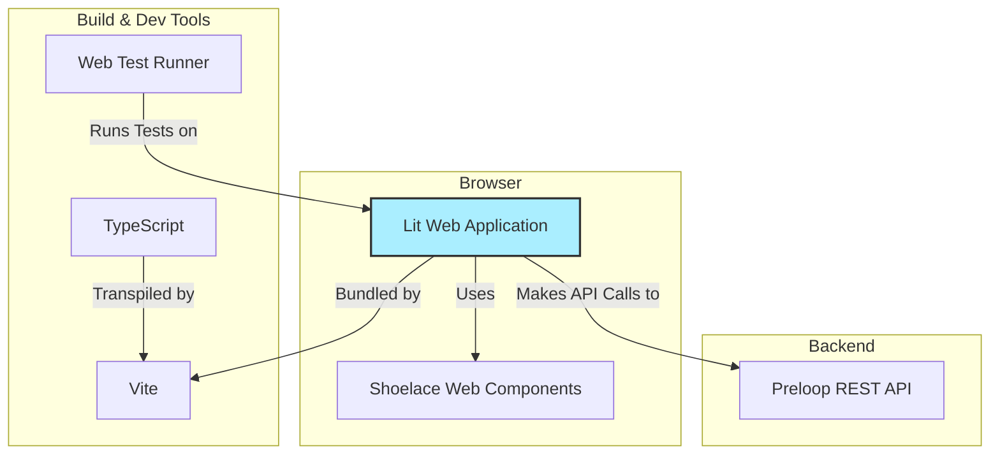

# Frontend Architecture

Editions: OSS. Contributor documentation for this repository.

The Preloop Console lives in `frontend`. This chapter covers the Lit/Vite/TypeScript stack, directory layout, and the tracker, tools, and cost views.

The frontend is in the `frontend` directory.

## Technology Stack

*   **Framework:** [Lit](https://lit.dev/) - A simple library for building fast, lightweight web components. It provides reactive state, scoped styles, and a declarative templating system.
*   **Build Tool:** [Vite](https://vitejs.dev/) - A modern frontend build tool that provides an extremely fast development experience with features like Hot Module Replacement (HMR) and optimized production builds.
*   **Language:** [TypeScript](https://www.typescriptlang.org/) - A statically typed superset of JavaScript that enhances code quality and maintainability.
*   **UI Components:** [Shoelace](https://shoelace.style/) - A set of high-quality, standards-based web components.

Shoelace's theme stylesheets, autoloader, lazily loaded components and icon set are served from the console's own origin under `/vendor/shoelace/`, copied from the installed package by `vite-plugin-shoelace-vendor.ts` (a dev-server middleware plus a copy into `dist/` at build time). Nothing is fetched from a CDN, so air-gapped and egress-restricted installs render fully and the themed components always match the version in `package.json`.

Every module that renders a console custom element imports it. `scripts/check-custom-element-imports.mjs` (run by `npm test`) fails when a Lit template renders an element from `src/components` without importing its module: otherwise the page works only when an earlier route happened to register the element, and a deep link renders it as an unknown tag.
*   **Testing:** [Web Test Runner](https://modern-web.dev/docs/test-runner/overview/) - A tool for testing web applications in a real browser, ensuring that components behave as expected in a live environment.

## Structure

The `Preloop Console` application is structured around a component-based architecture.

*   **`src/components/`**: This directory contains all the custom Lit components that make up the application. Each component is typically defined in its own file (e.g., `tracker-list.ts`) and may have a corresponding test file (e.g., `tracker-list.test.ts`).
*   **`src/table/`**: Shared headless list-table layer (`@tanstack/table-core`) used by console lists (executions first).
*   **`src/api.ts`**: A dedicated module for handling communication with the Preloop REST API. It encapsulates fetch logic, authentication, and data transformation.
*   **`index.html`**: The main entry point for the application.
*   **`vite.config.ts`**: Configuration for the Vite build tool.
*   **`package.json`**: Defines project metadata, dependencies, and scripts for development, building, and testing.

### Route loading and refreshes

The console uses the in-house router in `src/router` rather than
`@vaadin/router`. `lit-app.ts` keeps public pages available for prerendered
content and loads console components through `console-route-loaders.ts` only
when their routes match. `withLazyRoutes` attaches a `Route.load()` to each
lazy console view so the router fetches the chunk before creating the
element. While that promise is outstanding the loading renderer shows a
pending state; if the chunk fails it shows a failed state with a reload
rather than a blank outlet. New console routes should add their dynamic
import to this registry instead of adding an eager view import.

Overview keeps its initial refresh guard through the deferred data wave while
rendering the first results as before. Realtime refreshes retain at most one
pending follow-up per resource, and background refreshes skip runs while other
refreshes are active.
Agent detail likewise serializes reads and coalesces live events into one
follow-up. The session observer owns session interaction loading; the parent
uses the session list already returned by the agent endpoint.

### Capability-gated account views (`src/capabilities.ts`, `src/components/capability-extension.ts`)

Views served by an extension plugin (account switcher, subaccounts, access
grants, sharing, tags, usage by subaccount, access rules) are gated on the
`multi_account`, `account_hierarchy` and `abac_rules` keys of `/features`.
Their routes are added to the router only after `/features` reports the
capability (`CAPABILITY_ROUTES` in `lazy-routes.ts`), and pieces of existing
pages mount through `<capability-extension name=...>`, which downloads nothing
without the capability. The client for their endpoints is
`src/hierarchy-api.ts`: a 404 on a collection is "capability off" and hides the
view without a toast, and a 404 on one item is "not found". The endpoint
contract is in `docs/guide/accounts-and-profiles.md`.

### Tracker Detail Page (`src/views/authed/tracker-detail-view.ts`)

The Tracker Detail page is the entry point for issue analytics. Clicking a tracker card in the Trackers list navigates to `/console/trackers/:trackerId`, which shows:

*   **Tracker metadata:** Name, type, connection status, creation/update dates, URL, and scope rules.
*   **Issue Analytics cards:** Conditional links to Similarity, Compliance, and Dependencies views, gated by feature flags (`issue_duplicates`, `issue_compliance`, `issue_dependencies`). Each link pre-filters to projects belonging to that tracker via `?projects=` query parameters.
*   **Projects list:** All projects synced under this tracker.
*   **Issues tab:** Open issues for a selected project, with search and Run implementer on GitHub and GitLab.
*   **Pull requests tab:** Open pull requests (GitHub) or merge requests (GitLab), hidden for Jira. The list is live from the tracker (about a one-minute cache) with Run reviewer, using the same create-from-preset path as the issue implementer.

Issue analytics features are no longer accessible from the main sidebar, they are scoped to individual trackers via this detail page.

### Overview and Attention (`src/views/authed/dashboard-control-plane-view.ts`, `attention-view.ts`)

The Overview (`/console`) leads with five current-state counts (agents, flows, models, tools, need attention), the two gateway endpoints (model gateway and tool firewall), a Usage card (tokens or estimated dollars over one page-wide time range, with global budget rows and the limits dialog), and activity cards. "Need attention" links to `/console/attention`, which lists pending approvals, agents with setup or live-check problems, flows with failed runs, models with gateway failures, budgets over their soft or hard limit, and a stale price catalog. Both views derive their items with `utils/attention.ts` (`deriveAttentionItems`, pure) from the same inputs fetched by `utils/attention-data.ts` (`loadAttentionInputs`), so the hero count and the page agree. Any row except a pending approval can be dismissed ("expected", "snoozed for N days", or "fixed"), and a dismissal is stored server-side against the item's fingerprint: the client's summary of why the item is showing (the latest failed run id, the agent's onboarding, validation and latest-session failure state, the sorted list of unpriced aliases), so the item stays hidden only while that reason is unchanged and comes back by itself when it is not. One marker is deliberately stable: a model with no price at all can be marked unpriced-by-design from the Models list or the model detail page, which stores `model-unpriced:<alias>` against the fingerprint `unpriced:<alias>`. It carries no timestamp, so another unpriced request does not resurface the model; the Models count and badge, and the inbox's "N models unpriced" item, all leave it out until somebody restores it or the model gets a price (which stops the item being derived at all). The dismissals live behind `GET/PUT/DELETE /api/v1/attention/dismissals[/{item_id}]`: reading is open to any account member so the inbox renders the same for everyone, writing takes `manage_agents`, and the console hides the Dismiss/Restore controls (rather than showing buttons that 403) from members without it or against a server that predates the endpoint.

### Console surfaces (`src/styles/console-surfaces.css`, `console-styles.css`)

Every console background comes from one surface ladder declared per theme at document level: `--console-page`, `--console-surface`, `--console-surface-raised`, and `--console-hairline`. Declaring them on the document matters because Shoelace's dark theme is a class on `<html>` that shadow-scoped CSS cannot select, while custom properties inherit into every shadow root. In dark mode the ladder gets lighter with elevation (cards carry no border or shadow; the lightness step is the elevation); in light mode cards keep a hairline and the smallest shadow. Two rules follow from it and are enforced across the views: a depth limit of two (page, then surface: nothing inside a card gets a filled box of its own; rows separate by hairline), and states are tints, not paint (status chips are a 16% tint of their tone with dark ink; solid fills survive only on section count badges and the danger pill of a failed run). The design rationale lives in the private `DESIGN.md` (D27). Link text and meta text are tested for WCAG AA contrast on all three rungs in both themes (`console-surfaces.test.ts`).

### Tools Page (`src/views/authed/tools-view.ts`)

The Tools page is MCP and Native tabs, a summary strip of filterable counts, and the shared `list-toolbar`:

*   **Tabs:** MCP (proxied and built-in tools) is the default, restored from `?tab=` or `localStorage`. Native is the agent-source catalogue (Bash, Edit, Write, and others). The Native list body ships in a follow-up; this page keeps the tab, the Native defaults card, and a zero count until then.
*   **Summary strip:** Clickable counts (total, available, enabled, with rules, require approval). Each button is `aria-pressed` and toggles a single filter. The count slot is `aria-live="polite"`. Unavailable reasons stay in the tool-row tooltip.
*   **Toolbar:** Search plus Status, Server, Rules, and Workflow filters on `list-toolbar`, matching Models and Trackers. The List/Cards toggle is hidden (`views=['cards']`) until the flat table lands, so a stored view choice cannot change the page.
*   **Import/Export:** Full configuration export/import as YAML.
*   **Key components:**
    *   `tool-list-item.ts`: Individual tool row with expand/collapse, enable/disable toggle, rule summary badges, and drag-and-drop rule reordering.
    *   `tool-rule-editor.ts`: Dialog for creating/editing access rules with action selection (deny/require approval/allow), condition builder (simple or CEL), and approval workflow configuration (human or AI-driven).
    *   `approval-policy-dialog.ts`: Dialog for creating/editing approval workflows.
*   **Access rule UI semantics:** Actions use semantic icons and colors, Deny (red, `x-octagon-fill`), Require Approval (blue/primary, `shield-lock-fill`), Allow (green, `check-circle-fill`).

### Cost Analytics Area (`src/views/authed/cost-*`)

The Console exposes a dedicated Cost section (`cost-view.ts`, sidebar "Cost") rather than scattering spend data across gateway, sessions, and settings pages. The shared frontend renders both OSS and Enterprise panels, gated by feature flags returned by the API (`billing`, `model_price_overrides`, `session_optimization`).

Core open-source subviews:

*   **Overview:** Date-range spend, token volume, request count, budget utilization, and budget-health cards, with sortable Agents / Tools / Sessions / Users tabs.
*   **Breakdown:** Groupable tables and charts by model, provider, managed agent, runtime session, flow, API key, and user, backed by `/api/v1/cost/*` and `GET /api/v1/tools/stats` (per-tool call counts, schema-injection token estimates, and spend attribution).
*   **Budgets:** OSS surfaces account/flow gateway limits and burn-rate health; budget policies support notification recipients (`notification_user_ids`, `notification_team_ids`). Enterprise billing plugin owns scoped budget policy CRUD, enforcement, and notification workflows.

Enterprise feature-flagged subviews (via `plugins/billing/`):

*   **Pricing:** Per-account model price overrides for input/output/cache tokens, fixed request costs, currency, effective date, and provider-specific metadata.
*   **Session Value:** LLM-generated summaries that explain what happened in a session, whether the outcome appears worth the spend, and which expensive attempts failed or retried.
*   **Optimization:** Recommendations for cheaper model routing, prompt compaction, caching, batching, retry suppression, or policy changes.
*   **Forecasting & Anomalies:** Burn-rate forecasts, unusual spend detection, alerts, chargeback/showback, and export workflows.
