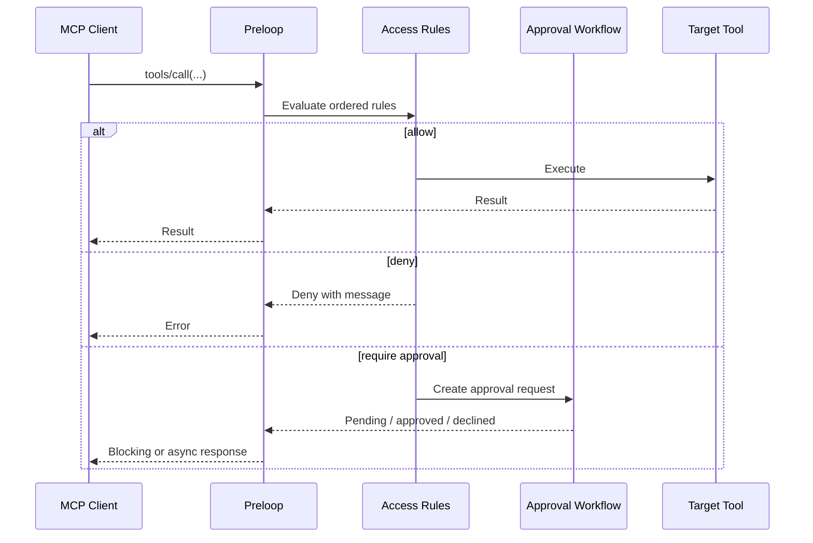

# MCP Tool Integration

Editions: OSS. Contributor documentation for this repository.

Preloop exposes one MCP endpoint to AI clients and evaluates policy before any
tool call reaches the underlying tool. The first half of this page is for
users connecting a client; the second half ("MCP Implementation") is for
contributors and covers HTTP transport, dynamic tool filtering, and the MCP
request path inside the FastAPI app.

## What MCP means in Preloop

MCP gives AI clients a standard way to discover tools, inspect their schemas,
and call them. Without Preloop the path is:

```text
AI client -> MCP server -> tool executes
```

With Preloop there is a policy decision in the middle:

```text
AI client -> Preloop MCP endpoint -> policy evaluation -> allow / deny / require approval
```

## Endpoint and transport

The endpoint is `https://YOUR_PRELOOP_URL/mcp/v1` over streamable HTTP.
`preloop agents onboard` writes this entry for supported agents; by hand it
looks like this:

```bash
claude mcp add \
  --transport http \
  --header "Authorization: Bearer YOUR_API_KEY" \
  preloop \
  https://YOUR_PRELOOP_URL/mcp/v1
```

## What happens on a tool call

1. **Authentication.** The client presents an API key or runtime credential.
2. **Tool filtering.** Preloop lists only the tools this caller should see.
3. **Policy evaluation.** Ordered access rules decide allow, deny, or require
   approval.
4. **Execution or approval.** Allowed calls run. Approval-gated calls wait for
   the configured workflow. Denied calls return an MCP error the agent can act
   on.



## Built-in tools and external MCP servers

One endpoint serves two kinds of tools. Built-in tools are Preloop's own (for
example `request_approval`, `get_approval_status`, and the issue tools that
appear once a tracker is connected). External tools come from MCP servers you
add on the Tools page and are proxied through Preloop. Both are governed by
the same access rules and approval workflows. See
[Built-in Tools](../guide/tools/builtin.md) and
[External MCP Tools](../guide/tools/external-mcp.md).

The tool list is not static. It depends on the caller (API key or managed
agent, see [Subject-Scoped Governance](../guide/concepts/subject-scoped-governance.md)),
the connected trackers, the registered MCP servers, and per-tool enablement.

## Blocking and async approval

With blocking approval the tool call waits while the workflow runs and
returns the final result in the same call. With
[async approval](../guide/approvals/async-approvals.md) the call returns at
once with a pending state and a request id, and the agent polls
`get_approval_status` until there is a decision and a result.

A policy-gated tool is an ordinary tool protected by access rules: the agent
calls it and Preloop decides whether approval is needed. `request_approval` is
different: the agent asks for approval as a deliberate step, useful when an
action spans several steps or the agent wants to give context first.

Related: [Safety Layer](../guide/concepts/safety-layer.md),
[Policy-as-Code](../guide/concepts/policy-as-code.md).

## MCP Implementation
The MCP server is implemented directly within the FastAPI application using a custom
extension of FastMCP. This provides several advantages:
- **HTTP Transport:** Natively supports HTTP-based MCP clients via StreamableHTTP,
enabling secure remote access.
- **Unified Authentication:** Leverages the same JWT authentication as the rest of the
API.
- **Code Reusability:** Directly calls internal services and CRUD operations, reducing
code duplication.
- **Scalability:** Benefits from the same deployment and scaling infrastructure as the
main API.
### Dynamic Tool Filtering
The MCP server implements per-user dynamic tool filtering using `DynamicFastMCP`, a
custom subclass of FastMCP:

**Implementation Details:**
- **`DynamicFastMCP`** (`preloop/services/dynamic_fastmcp.py`): Extends FastMCP and
overrides `_list_tools()` and `_mcp_call_tool()` methods
- **Tool Visibility:** Default tools (get_issue, create_issue, update_issue, search,
add_comment, estimate_compliance, improve_compliance) are only visible when the
authenticated account has one or more trackers configured. A tool whose definition
sets `default_enabled: false`, such as the two compliance tools, additionally needs
an explicit enable on the Tools page or a flow allow-list entry
- **User Context Propagation:** Uses Python's `ContextVar` for async-safe user context
storage across request boundaries
- **Authentication:** `PreloopBearerAuthBackend` validates JWT tokens and injects user
context into the request scope
- **Middleware:** `UserContextMiddleware` extracts authenticated user info and stores
it in a ContextVar for access during tool listing and execution
- **StreamableHTTP Transport:** Uses FastMCP's proven `http_app
(transport="streamable-http")` implementation for bidirectional streaming
- **Endpoint:** Mounted at `/mcp/v1` with full authentication and lifespan management

**Tool Registration:**
All built-in tools are registered in `preloop/services/initialize_mcp.py` using
FastMCP's `@mcp.tool()` decorator, then filtered at runtime based on user context.
Tools whose advertised schema must match the REST catalogue exactly take their
description and JSON schema from `preloop/tools/builtin_defs.py` and are added with
`FunctionTool.from_function`, so `preloop/api/endpoints/tools.py`,
`initialize_mcp.py` and `dynamic_mcp_server.py` cannot drift apart.

### Session search tool

`search_sessions` lets an agent query the runtime session corpus before
repeating work it already did. It is default-off, scoped to the calling agent's
own sessions unless an operator grants the account wide scope, and its answer is
size-capped so a search cannot flood a context window. The tool definition lives
in `preloop/tools/builtin_defs.py`, the scope and cap rules in
`preloop/services/agent_session_search.py`, and the guide is at
[docs/guide/agent-session-search.md](../guide/agent-session-search.md). Every
call it makes is audited with the agent as the actor; what the row carries is
described in
[docs/guide/session-search-audit.md](../guide/session-search-audit.md).

### Artifact deposit tool

`deposit_artifact` lets an agent that only has the Preloop MCP URL store a file,
image, transcript or text on its own runtime session (#1081). The session comes
from the session-bound key, never an argument; a key without one gets the tool
error `artifact_no_session`. The input is one MCP `ContentBlock` (`text`,
`image`, `audio`, `resource`, or a `resource_link` to an artifact of the same
session, which copies it with new labels as a child). Storage, the `artifact`
timeline row and every error code are the deposit service
(`preloop/services/artifact_deposit.py`); the MCP adapter is
`preloop/services/artifact_mcp_tools.py`. The result is a `CallToolResult` with
one `resource_link` block (absolute URI under `PRELOOP_URL`) and the artifact
descriptor as `structuredContent`. Errors are tool errors whose text starts
with the deposit API's code string. Default-off: enable it on the Tools page or
list it in a flow's `allowed_mcp_tools`.

### Artifact read tools

`search_artifacts` and `get_artifact` (#1104) are the read half of
`deposit_artifact`, for example for a scheduled evaluator. Both are
default-off. Scope follows `search_sessions`: `own` (default) is the artifacts
of sessions the calling agent identity (`runtime_principal_id`) ran, across
runs (for a flow execution, whose principal is the execution id: every
execution of the same flow); `account` needs the `artifact_search.account_scope` grant in the
governance store (read in core by `account_scope_granted`, written by EE) and
is refused as `account_scope_not_granted` without it. `get_artifact` answers an
id outside the caller's scope with `artifact_not_found`. Results use the shared
MCP mapping (`preloop/services/artifact_shapes.py`): `ResourceLink` blocks for
search hits, an `EmbeddedResource` (text up to `max_bytes`, small binaries up to
1 MiB) or a `ResourceLink` for a read, with `truncated` in
`_meta["preloop.dev/artifact"]`. Every call writes an audit row
(`resource_type` `runtime_session_artifact`, action `query` or `read`, actor
`source` `mcp`). Code: `preloop/services/agent_artifact_read.py`; guide:
[docs/guide/artifacts.md](../guide/artifacts.md#reading-artifacts-from-an-agent).

### Issue tools

`get_issue` and `update_issue` carry the issue triage surface. There are no separate
triage tools: triage is an option on the standard pair.

`get_issue(issue, include=None)` returns the synchronized issue. `include` accepts:

| Value | Added to the response |
| --- | --- |
| `label_catalog` | `label_catalog`, `complexity_scheme`, `risk_scheme`, `readiness_scheme` |
| `revision` | `expected_revision`, `provider_issue` |

Any `include` entry also sets `triage_limitations` and `concurrency`, and makes the
call read the tracker live rather than only the local snapshot. An unknown entry is
a 422. Without `include`, `get_issue` performs no provider read and the triage fields
stay `None`.

`update_issue` keeps its metadata parameters and adds `expected_revision`,
`assessment`, `complexity_label`, `risk_label` and `readiness_label`. A triage write needs both `expected_revision`
and `assessment`, returns the triage receipt instead of the plain update response,
and may not be combined with `description`, `status`, `priority`, `assignee`,
`labels`, `add_reaction` or `remove_reaction`; `title` is allowed. The triage write
requires the `edit_issues` permission and is GitHub and GitLab only.

Triage writes record a server-written receipt on the issue. Flow trigger suppression
keys on that receipt, not on which tools a flow selected, so any flow that produces a
matching write is suppressed and a lookalike event without a receipt is not.

**Benefits:**
- Zero performance overhead for tool registration (happens once at startup)
- Dynamic filtering happens only during tool list requests
- Full compatibility with FastMCP's StreamableHTTP implementation
- Backward compatible with existing authentication infrastructure

## Database session lifetime

Native MCP tool functions own a lazy database session per invocation through
`_with_tool_db`. The dependency generator remains alive until the tool finishes,
and the session closes on success, error, or cancellation. FastMCP invokes these
functions directly, so FastAPI does not manage their database dependencies.

Successful calls commit any remaining active transaction without expiring loaded
ORM attributes. Errors and cancellation roll back before cleanup; failed
rollbacks invalidate the connection. Database exceptions, including those wrapped
by HTTP errors, return a generic message without SQL or bound parameters. Error
classification uses exception types and chains, not provider message text.
Compliance batch tools also roll back and sanitize database failures caught per
item, so the next item can use the session normally.

This boundary does not make external tracker writes or earlier CRUD commits
atomic: database rollback cannot undo them. Check the provider outcome before
retrying a write after a database failure.

Pull request and comment tools resolve tracker configuration and identifiers,
then close their read transaction before awaiting external tracker operations.
The tracker factory currently constructs clients without network I/O. Proxied
MCP tools likewise snapshot server configuration and release the database session
before connecting or calling a remote tool. Database writes after a provider
response can reopen the invocation's session and are still covered by final
cleanup. Concurrent provider waits therefore do not each reserve a database
connection on these paths.

## MCP Flow (Integrated HTTP)
1.  **MCP Client Request:** An MCP client (e.g., Claude Code) sends a tool request using streamable HTTP transport to the MCP server (e.g., `/mcp/v1`). The request includes the standard MCP payload and an `Authorization: Bearer <token>` header.
2.  **Preloop API Server:**
    *   Authenticates the request using the JWT token.
    *   Routes the request to the appropriate MCP tool endpoint.
    *   Validates the incoming MCP parameters against the Pydantic schema for that tool.
    *   Executes the tool logic, interacting with other Preloop services and `preloop.models` as needed.
    *   Formats the result into the standard MCP JSON response format.
3.  **MCP Client:** Receives the HTTP response containing the tool's output.

The `preloop tools list|describe|exec` CLI commands reuse this same `/mcp/v1` surface, so the backend remains the single source of truth for tool visibility and policy enforcement.

## Governed usage rows

Each governed tool call writes one `runtime_session_activity` row. `status` is `succeeded`, `refused` (a policy or approval denial), or `failed` (the handler or the upstream server errored). Older rows may still say `success`; readers treat any status that starts with `succ` as success. The row does not store the argument payload. `metadata.arguments_summary` is key names and sizes, and `metadata.arguments_hash` distinguishes same-shape calls for loop detection. `metadata.started_at` is the call start, so a timeline can match a parsed "detected" marker (stamped at start) to the row (stamped at end) for calls longer than a few seconds. The execution detail's `mcp_usage_logs` entries expose `status`, `summary`, `error`, and `arguments_summary` rather than the raw metadata object.
