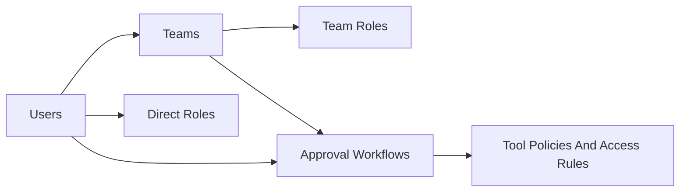

# Teams In Approval Workflows

Editions: Cloud, Enterprise.

Teams in Preloop are reusable groups of users. They matter in three places:

- **membership and organization** inside your account
- **inherited RBAC roles** for users
- **approval workflow routing** when a workflow should notify a group instead of a single person

Teams, team-based workflows and multi-user quorum behavior need Cloud or Enterprise. RBAC and team management ship as a plugin; the open-source server enforces the resulting permissions. In OSS a workflow has one approver and **Approvals Required** stays at 1.

## How The Data Model Fits Together

Use this mental model when configuring teams:

Key points:

- Users can have **direct roles**.
- Users can also inherit permissions through **team roles**.
- Invitations can automatically add a new user to one or more teams.
- Approval workflows can include **users**, **teams**, or both as approvers.
- The **quorum** belongs to the approval workflow, not to the team.

---

## Creating And Managing Teams

Go to **Settings > Teams**.

The current team UI supports:

- creating a team with **Team name** and **Description**
- editing that basic metadata later
- opening a **Team Members** modal to add or remove members
- opening **Manage Team Roles** to assign RBAC roles to the team

<figure>
  
  <figcaption>The Teams page is a lightweight management surface for team metadata, members, and team roles.</figcaption>
</figure>

That means teams are intentionally lightweight. They do **not** currently have their own:

- notification channel settings
- team-level quorum settings
- team hierarchy
- on-call rotation
- analytics dashboard
- workflow stages or delegation rules

### Recommended Team Structure

Create teams that match real approval or permission boundaries, for example:

- `Support`
- `Finance`
- `SRE`
- `Security`
- `Platform`

Keep team names stable so they remain meaningful when reused in multiple approval workflows.

---

## Members, Roles, And Invitations

### Team Members

Members are managed after the team is created.

From **Team Members** you can:

- review the current member list
- add a user to the team
- remove a user from the team

<figure>
  
  <figcaption>Members are managed from the Team Members modal after the team already exists.</figcaption>
</figure>

### Team Roles

Team roles are RBAC roles assigned to the team itself. Every user on that team inherits those permissions.

This is why each user on the **Users** page shows both:

- **Roles**: assigned to the user directly
- **From teams**: inherited through team membership

Use team roles when you want a permission change to apply to a group instead of managing each user individually.

<figure>
  
  <figcaption>Team roles are RBAC roles assigned to the team, then inherited by each member.</figcaption>
</figure>

<figure>
  
  <figcaption>The Users page shows the difference between direct roles and roles inherited through teams.</figcaption>
</figure>

### Invitations

From **Settings > Invitations**, you can invite a user by email and optionally pre-select the teams they should join after accepting the invitation.

This is useful for onboarding because it lets you:

- invite the user once
- place them into the right teams immediately
- give them inherited permissions through those teams

<figure>
  
  <figcaption>Invitations can pre-assign a new user to one or more teams during onboarding.</figcaption>
</figure>

---

## Using Teams In Approval Workflows

Teams earn their keep as approver groups.

An approval workflow can include:

- specific users
- one or more teams
- or a mix of both

### Example: Single Team Approver

If a workflow uses the `Support` team with **Approvals Required = 1**, any one eligible member of that team can approve the request.

### Example: Team Plus Quorum

If a workflow uses the `Finance` team with **Approvals Required = 2**, the request is routed to the workflow's approver pool and two approvals are needed before execution continues.

### Example: Mixed Approvers

A workflow can combine:

- the `Finance` team
- one named CFO user
- one named legal approver

Preloop then counts approvals across that configured approver set.

---

## How Quorum Actually Works

Quorum in Preloop is a **single workflow-level integer**: **Approvals Required**.

That means:

- quorum is defined on the workflow
- quorum is counted across the workflow's approver pool
- the team itself does not carry its own quorum rule

For example:

- Approvers: `Finance Team` + `cto@company.com`
- Approvals Required: `2`

This means any two valid approvals across that combined set satisfy the workflow.

---

## Notifications: User-Level, Not Team-Level

Notification delivery is configured primarily per user.

That means:

- users receive email and mobile notifications based on their own settings
- workflow-level Slack / Mattermost / webhook integrations belong to the workflow configuration
- teams themselves do not have a dedicated notification-settings page

So the right mental model is:

- **team** = who belongs together
- **workflow** = who should be asked
- **user notification preferences** = how each person gets notified

For notification-channel details, see [Multi-Channel Notifications](notifications.md).

---

## Good Patterns

### Pattern 1: Functional Approver Group

Use a team like `Support` or `Finance` as the approver group for a workflow that many tools share.

### Pattern 2: Group Permissions Plus Workflow Routing

Assign the team a role for the permissions they need in the console, then reuse the same team inside approval workflows.

### Pattern 3: Multiple Teams, One Workflow

Use multiple teams in a single workflow when more than one group is allowed to respond and a shared quorum is sufficient.

---

## Related Pages

- [Roles & Permissions](../users/roles.md)
- [Managing Teams](../users/managing-teams.md)
- [Multi-Channel Notifications](notifications.md)
- [Conditional Approval (CEL)](cel-expressions.md)
- [Native Tool Approvals](ai-approvals.md#native-tool-approvals): route agents' shell and file operations to the same team-based workflows
