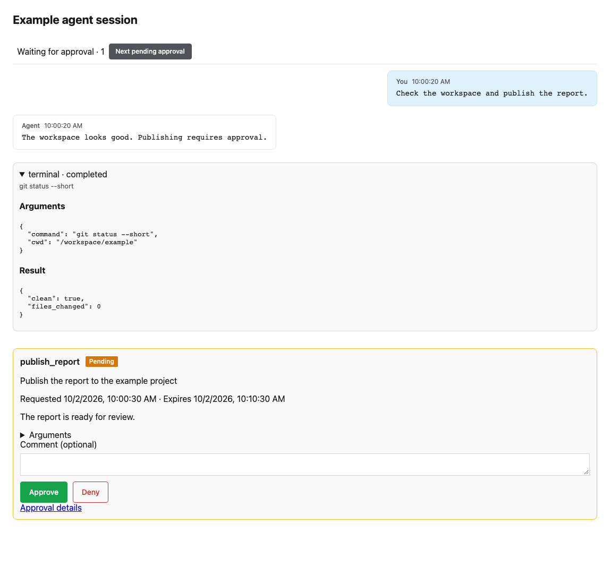

# Runtime Sessions

Editions: OSS, Cloud, Enterprise. Unless stated otherwise, everything on this page ships in OSS.

A **runtime session** is Preloop's durable identity for one stretch of work by a managed runtime: a flow execution today, or an enrolled OpenClaw/Hermes desktop session going forward.

Sessions let operators answer: *who was running, what did they call, and what did it cost?*

---

## What a Session Represents

Each runtime session ties together:

- a **runtime principal** (the enrolled agent identity)
- optional links to a **managed agent** record and **flow execution**
- captured **gateway interactions**, tool activity, and operator lifecycle events
- spend and token totals derived from the `ApiUsage` ledger

One enrolled installation can accumulate many sessions over time while keeping one durable managed-agent identity for audit history.

---

## Where Sessions Appear

In the console you can inspect sessions from:

- **Agents**: live canvas and detail views for enrolled runtimes
- **Audit → Sessions**: account-scoped session explorer with transcript, replay, requests, and the [Optimize](../cost/session-optimization.md) tab
- **Cost**: spend grouped by session, model, agent, or API key
- **Models**: per-model usage with session-level drill-down

Operators can **end a session explicitly**. That updates runtime state, emits audit and realtime events, and refreshes managed-agent summaries.

---

## How Sessions Are Created

Common creation paths:

1. **Managed CLI onboarding**: `preloop agents discover` or `preloop agents onboard <agent>` mints a runtime credential bound to a session reference such as the local config path.
2. **Flow execution**: running a flow creates an execution-scoped session bridge.
3. **Agent Control**: when a runtime plugin connects to `WS /api/v1/agents/control/ws`, presence binds to the active managed agent and refreshes session activity.

---

## Session Explorer

Account-scoped APIs expose recent sessions plus captured gateway interactions. The console can drill from aggregate usage charts into one session timeline: model calls, tool calls, approvals, and operator actions on the same canvas.

Flow execution detail also includes a **Gateway Events** tab for execution-scoped model-call inspection.

---

## Related

- [What Preloop includes](../functionality.md)
- [AI Model Gateway](model-gateway.md)
- [Agent Control Runtime Adapters](../integrations/agent-control-runtime-adapters.md)
- [Quick Start: CLI onboarding](../quickstart-cli.md)

## Following live work and decisions

Talk, Conversation and Transcript share a live activity line and inline approval
cards. `Model processing` describes an observed request with a stable request ID;
`Tool requested` describes a model-emitted call, and `Running` requires executor
start evidence. Transport reconnection is displayed separately. A stale unmatched
start becomes `Activity unavailable` rather than claiming continuous processing.

Captured tools appear by name with a readable command, path or arguments summary.
Expand a card to inspect formatted Arguments and Result. Missing, redacted and
truncated captures remain marked; a completed model request does not imply that
its requested tool ran successfully.

Pending approvals load for the selected session, including pending requests older
than the first history page. Use **Next pending approval** while reading older
history. Approve, Deny, question answers and schema forms stay in place; denial
still asks for confirmation. A recorded quorum vote can remain pending until the
remaining approvers decide. Resolved cards retain their outcome and attribution.
Viewing and deciding require the existing approval permissions, and the full
approval page remains available through **Approval details**.

The following desktop example uses synthetic session and approval data:

Screenshot reproduction: run local Vite servers for the base and implementation
revisions, then from `frontend` run
`PRELOOP_DISABLE_TELEMETRY=true node scripts/capture-live-session.mjs http://127.0.0.1:5190 http://127.0.0.1:5189`.
The script intercepts all API reads and uses a fixed clock and generic fixtures.
