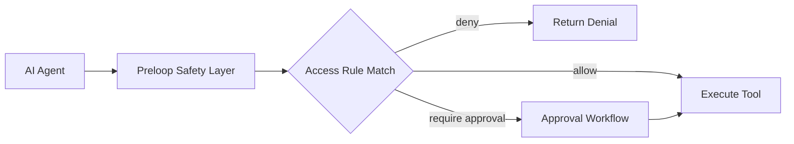

# Safety Layer And Access Rules

Editions: OSS, Cloud, Enterprise. Unless stated otherwise, everything on this page ships in OSS.

Preloop is an AI safety and control platform for agents. The Safety Layer is the part of Preloop that evaluates tool calls before they execute.

Instead of giving an agent unrestricted tool access, you place Preloop in front of the tool and define what should happen for each request. This safety-layer model works alongside Preloop's model gateway, runtime observability, budget controls, and audit surfaces.

---

## The Core Model

For every tool call, Preloop evaluates ordered access rules and chooses one outcome:

- **allow** - execute immediately
- **deny** - block the request with a clear message
- **require approval** - route the request to an approval workflow

That means approvals are important, but they are only one part of the overall policy model.

---

## What The Safety Layer Adds

Preloop lets you define:

- which tools are exposed to which users
- multiple ordered rules per tool
- CEL conditions on tool arguments and context
- human and AI-driven approval workflows
- justification requirements for sensitive actions
- audit history for allowed, denied, and approved requests

This is the main shift from older approval-only framing: Preloop is not just asking for approval. It is enforcing policy before execution. In the broader platform, this sits next to model traffic governance, runtime identity, and operator-facing observability.

---

## Access Rules vs Approval Workflows

These two concepts work together but they are different:

### Access Rules

Access rules live on a tool and answer:

- when should this action be allowed?
- when should it be denied?
- when should it require approval?

### Approval Workflows

Approval workflows answer:

- who is allowed to approve?
- how many approvals are required?
- whether escalation is enabled
- whether a human or AI approver is used

In practice:

- **access rule** decides whether approval is needed
- **approval workflow** decides how approval is handled

---

## Blocking And Async Approval

Preloop supports two approval patterns:

### Blocking Approval

The MCP tool call waits while a human approves or declines.

Use this when the client can tolerate waiting and you want the final tool result to come back in the same interaction.

### Async Approval

The tool returns immediately with a pending approval state and a request identifier. The client then polls for status until the decision is made.

Use this when the client should not sit on a long-lived request.

---

## Why This Matters

Without a Safety Layer, teams usually choose between two bad options:

- give the agent broad access and hope nothing goes wrong
- lock everything down and lose the productivity benefit

Preloop gives you a middle path:

- safe actions can stay fast
- dangerous actions can be blocked
- risky actions can wait for the right human workflow

That is the foundation for both:

- safe interactive agent use
- safe event-driven agentic workflows

It is also one pillar of a larger AI control plane that can attribute activity, enforce model budgets, and keep runtime behavior auditable.
