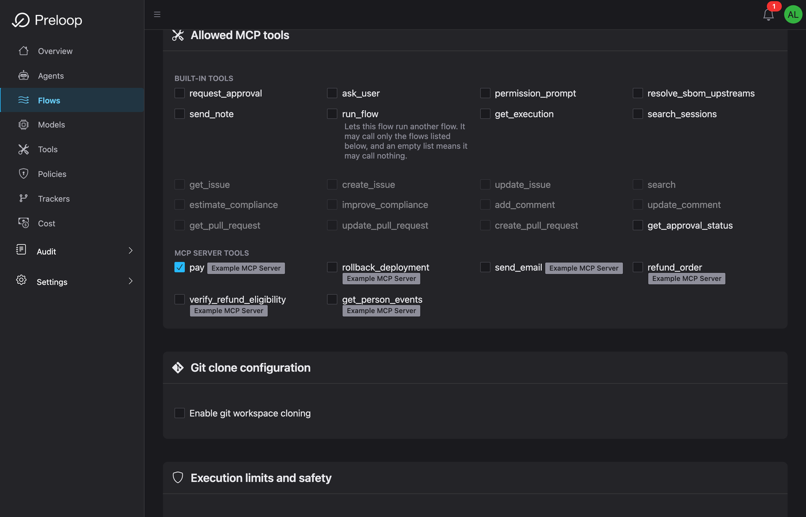
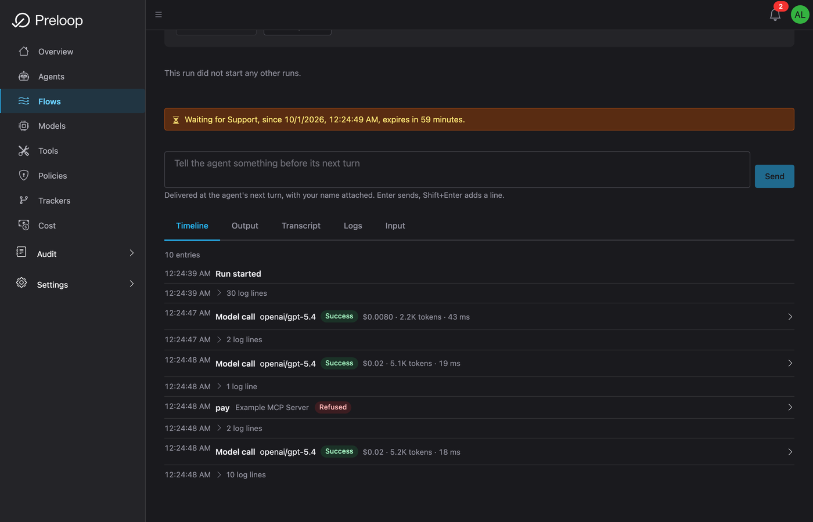

# Quick Start Part 2: Agentic Flows in 5 Minutes

Editions: OSS, Cloud, Enterprise. Unless stated otherwise, everything on this page ships in OSS.

Build an event-driven workflow that uses your protected tools with an AI agent.

!!! note "Prerequisites"
    Complete [Part 1: Safety Layer](quickstart.md) first to set up your account, policies, and protected tools.

!!! success "What You'll Accomplish"
    - Configure an AI model for your flows
    - Create an automated payment processing flow
    - Trigger the flow and see the approval workflow in action
    - Learn how to trigger flows via webhooks

---

## Step 1: Create Your AI Model (1 minute)

Flows need an AI model to execute tasks. Let's add one.

1. Open **Flows** in the sidebar
2. Click **Create flow** (the presets further down the page can wait)
3. Under **AI model**, click **Add AI model**
4. Fill in:
    - **Name:** `GPT-5.4`
    - **Type:** Inference / chat
    - **Provider:** `OpenAI`
    - **Model Name / ID:** `gpt-5.4`
    - **API key:** Your OpenAI API key

5. Click **Save**

You can also add models under **Models > Add model**.


*The Add model dialog. **Model Name / ID** appears after **Fetch models from provider**, or as a text field if the fetch fails.*

!!! info "Don't Have an OpenAI Key?"
    Get one at [platform.openai.com/api-keys](https://platform.openai.com/api-keys), or add a model from any other supported provider.

**✓ Checkpoint:** You now have an AI model configured!

---

## Step 2: Create a Payment Approval Flow (2 minutes)

Let's create a flow that processes contract payments. If the amount exceeds your threshold, it will require approval.

**Flow Scenario:**

When triggered (manually or via webhook), the flow will:

1. Receive payment details (recipient, amount, contract_id)
2. Use the prelooped `pay` tool to send payment
3. If amount exceeds the condition, require approval first
4. Report the result

**Create the Flow:**

1. You're already on the **Create Flow** page. Fill in:

   - **Flow name:** `Contract Payment Processor`
   - **Description:** `Process contract payments with approval for large amounts`
   - **Trigger type:** **Webhook** (the webhook URL is generated after creation)
   - **AI model:** the model you just added
   - **Prompt template:**

     ```
     You are a payment processor. Process the payment with these details:

     Recipient: {{trigger_event.payload.recipient}}
     Amount: ${{trigger_event.payload.amount}}
     Contract ID: {{trigger_event.payload.contract_id}}

     Use the pay tool to send the payment. The tool is configured with
     an approval workflow - small amounts are auto-approved, larger amounts
     require human approval.

     After payment completes, report the status. Do not retry if declined.
     ```

   Under **MCP Server Tools**, make sure **pay** is checked. You can uncheck other tools.

2. Click **Create flow** at the bottom


*The tools section of the new flow, with **pay** checked under MCP Server Tools*

**✓ Checkpoint:** Your flow is created!

---

## Step 3: Test Your Flow (2 minutes)

Now let's trigger your flow and see the approval workflow in action!

**Trigger the Flow:**

1. You should now be on the flow details page (flows you create start enabled)
2. Click **Run now**
3. The dialog **Values for the trigger event** asks for the template variables. The run is a real one and spends like any other
4. Fill in:
    - **trigger_event.payload.recipient:** `contractor@example.com`
    - **trigger_event.payload.amount:** `150` (above the $100 auto-allow limit from Part 1)
    - **trigger_event.payload.contract_id:** `CONTRACT-2026-001`

5. Click **Run now**


*Running the flow with sample payment data, which triggers the approval workflow*

**Watch the Execution:**

You'll be redirected to the execution page where you can see the AI agent working:

1. The agent will read your prompt
2. It will attempt to call the `pay` tool with amount=$150
3. **Because of the rules you set on `pay` in Part 1**, the Support workflow gets an approval request


*Flow execution in progress: the AI agent is processing the request*


*The run is waiting for the Support workflow to approve the payment*

**Approve the Payment:**

The approver receives an email with a subject such as "Tool Approval Required: pay" (when the agent names itself or summarizes the request, the subject says so instead).

1. Click **Approve** in the email, or:
   - Approve from **Audit > Approvals** in the console
   - Approve from the [mobile app](clients/mobile-apps.md)
2. Go back to the flow execution page
3. Watch the agent complete the payment after your approval!

**✓ Checkpoint:** You've successfully run an automated flow with human approval!

---

## Triggering via Webhook

Your flow has a unique webhook URL. You can trigger it from external services!

1. Go back to your flow details page
2. Find the **Webhook URL** section
3. Copy the URL (looks like: `https://preloop.ai/api/v1/webhooks/flows/{flow_id}/{webhook_secret}`)

**Test with curl:**

```bash
curl -X POST 'YOUR_WEBHOOK_URL' \
  -H 'Content-Type: application/json' \
  -d '{
    "recipient": "vendor@example.com",
    "amount": 50,
    "contract_id": "CONTRACT-2026-002"
  }'
```

This payment runs without approval because it is at or below $100.

**Try with a larger amount:**

```bash
curl -X POST 'YOUR_WEBHOOK_URL' \
  -H 'Content-Type: application/json' \
  -d '{
    "recipient": "vendor@example.com",
    "amount": 500,
    "contract_id": "CONTRACT-2026-003"
  }'
```

This one needs the CFO workflow's approval. Anything above $1,000 is denied by the last rule.

---

## Success! You've Built Safe Automation

You've just:

- **Set up the Safety Layer**: protected a risky tool with policies (Part 1)
- **Built an automated workflow**: created a flow with an AI agent
- **Tested end-to-end**: triggered the flow, got approval request, watched it execute
- **Learned webhook triggers**: you can now trigger flows from external services

---

## What's Next?

**Learn the flow building blocks:**

Go deeper on how flows are created, triggered, and executed:

- **Creating Flows**: build reusable AI-driven workflows
- **Flow Triggers**: understand webhooks and other trigger types
- **Flow Execution**: inspect status, history, and outcomes

[Creating Flows →](flows/creating-flows.md) | [Flow Triggers →](flows/flow-triggers.md) | [Flow Execution →](flows/flow-execution.md)

**Advanced Approval Workflows:**

Make approval smarter with conditional logic:

- Approve only if `environment == "production"`
- Different approvers for different amounts
- Team-based approval with quorum (require 2 of 5 approvers), Cloud and Enterprise
- Escalation chains, Cloud and Enterprise

[Conditional Approval (CEL) →](approvals/cel-expressions.md) | [Team-Based Approvals →](approvals/teams.md)

**Connect Your Own MCP Servers:**

Put tools from any MCP server behind Preloop:

- Deployment tools
- Database operations
- Cloud provider APIs
- Your custom MCP servers

[External MCP Tools →](tools/external-mcp.md)

---

## Learn More

**Core Concepts:**

- [MCP Integration](../architecture/mcp.md): how Preloop protects MCP tools with policies
- [Policy-as-Code](concepts/policy-as-code.md): generate and manage policies programmatically

**Flows:**

- [Creating Flows](flows/creating-flows.md): complete guide
- [Flow Triggers](flows/flow-triggers.md): all trigger types
- [Flow Execution](flows/flow-execution.md): monitoring and debugging

**Advanced:**

- [Team-Based Approvals](approvals/teams.md): approver groups, inherited roles, and quorum behavior
- [Mobile Apps](clients/mobile-apps.md): approve from iPhone, iPad, Apple Watch, or Android
- [External MCP Tools](tools/external-mcp.md): protect tools from your own MCP servers

---

## Need Help?

- [Full Documentation](../index.md)
- [Support Email](mailto:support@preloop.ai)
- [Discord](https://discord.gg/P6nWSee4jv)
