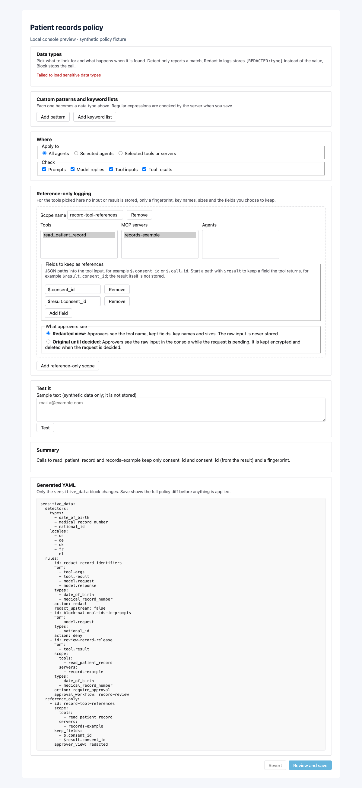
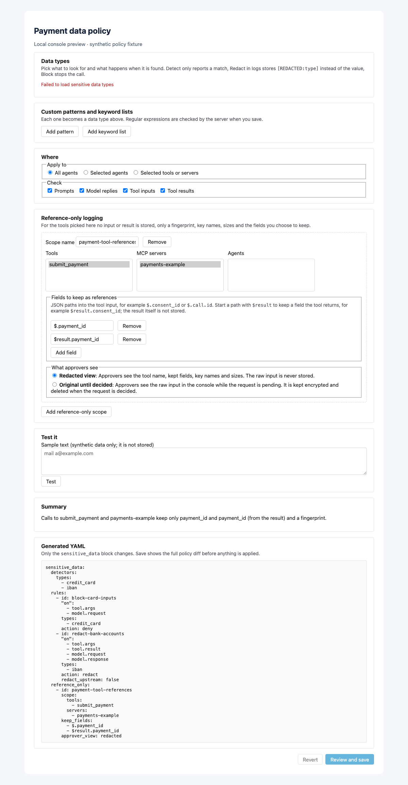

# Sensitive-data handling

Editions: OSS, Cloud, Enterprise. Detection and the policy configuration ship
in OSS. Audit views, chain exports and other extension-backed stores are
available when those services are installed.

Use **Policies → Sensitive data** to select detectors, configure actions and
reference-only tool scopes, and test synthetic text before applying the policy.
The same configuration can be managed as policy YAML. This guide explains what
is detected, what leaves the process, and what each store retains.

## Detection and its limits

Detection is best effort, not a compliance guarantee. A match is evidence that
a configured pattern was found, not proof of a person's identity or that the
value is real. A missing match does not prove that a payload is safe.

| Type | Detects | Known limits |
| --- | --- | --- |
| `email` | Mailbox-shaped addresses | Unusual spellings and obfuscation can evade it. |
| `phone` | E.164 and supported US/European national formats | Country context and number-like identifiers can cause false positives. |
| `credit_card` | 13–19 digits passing Luhn | A checksum is not proof of a real account; unsupported or obfuscated forms can be missed. |
| `iban` | IBANs passing mod-97 | Does not identify the account owner or validate that the account exists. |
| `ip_address` | Parseable IPv4/IPv6 addresses | A detected address is not necessarily personal data. |
| `date_of_birth` | A date near a birth keyword, such as DOB or Geburtsdatum | Unlabelled dates and unfamiliar languages may be missed. |
| `national_id` | US SSN shape, DE tax-ID check, UK NINO, FR NIR check, keyword-anchored NL BSN check | Only supported locales/formats; US shape matching has no checksum. Narrow `locales` when appropriate. |
| `medical_record_number` | Identifier following MRN, patient-ID or supported record keywords | Unlabelled identifiers are missed; configure `medical_record_number_pattern` for your format. |
| `person_name` | Honorific- or label-anchored names | Low recall by design: arbitrary names in prose are not reliably detected. |

Custom patterns and whole-word keyword lists belong in
`sensitive_data.detectors`. Pattern and timeout limits are documented in
[Model content policies](model-content-policies.md#sensitive-data-types).
Tool scans examine string and numeric leaves, and result text/structured
content. Value-level structured redaction rewrites **string values only**;
object keys and non-string values remain. Keep identifiers as strings and test
the exact representation your tools use. Redaction is not an OCR or binary-file
scrubber.

## Actions and upstream behavior

| Configuration | Effect |
| --- | --- |
| `action: notify` (detect only) | Records a notice when the notice/audit services are available and continues. It does not redact or block. |
| `action: redact` | Replaces detected spans in stored string values with `[REDACTED:<type>]`. Default: original upstream, redacted at rest. |
| `action: deny` (block) | Refuses tool arguments before forwarding; a result rule replaces the result after the tool has already run. Model-request rules block before the provider call. |
| `action: require_approval` | Pauses arguments/results or model content for a configured human workflow/account default; fails closed without a usable workflow. |

`redact_upstream: true` additionally rewrites arguments sent to a tool, a tool
result returned to the agent, or a model request sent to the provider. It can
break a tool that needs the original identifier. It is not supported for model
responses; those can be redacted at rest. Blocking a result cannot undo effects
of the tool that already ran.

Tool rules use `scope.tools` (client-visible names), `scope.servers` (MCP server
names; builtins use `preloop-mcp`) and `scope.agents` (managed agent IDs). Model
targets honor agent scope, not tool/server scopes. An empty scope covers every
call for its targets. Detectors run only when a rule is in scope.

Each rule has `detector_timeout_ms` (default 500) and
`on_detector_timeout` (default `deny`). A timeout normally fails closed;
notify-only rules are skipped. Setting the timeout mode to `allow` permits that
rule to be skipped, so review it deliberately.

## What is stored

The following applies to **new records** covered by the configured scope.
Installing a rule does not rewrite historical rows or erase external copies.
Ordinary capture settings and retention still determine whether a store has a
record at all.

| Store/surface | Redaction mode | Reference-only tool mode |
| --- | --- | --- |
| Tool-call audit and policy-decision rows | Scoped matches are redacted before storage/sealing; decision, types and counts remain. | Arguments/results become reference records. Tool/server/principal, rule, decision, kept values, fingerprints, sizes and timing remain. |
| Approval requests | Stored string matches are redacted. | Approver sees the reference by default; the explicit temporary-original mode below is the exception. |
| Runtime activity summaries and tool-call search index | Scoped stored tool content is redacted before summaries/indexing. | Indexed tool content is the reference, not the omitted arguments/result. Kept values can still be searchable. |
| Model usage/request/response capture | Model-target redact rules apply to captured content. Tokens, duration, status and cost remain. | Tool reference scopes do not remove independent model text. Configure model-target rules separately. |
| Notification delivery | Notices describe matching rules/types, without raw detected previews. | Original approval arguments do not enter emails, webhooks or push payloads. |
| OpenTelemetry | Raw prompts, completions and tool arguments are never span attributes. IDs, model/provider, status, token counts, duration and cost remain. | The same metadata-only span contract applies. |
| Agent files, evidence archives, native checkpoints and upstream/provider logs | Tool/model record redaction is not a general file or external-log scrubber. | A tool reference rule does not erase copies an agent or upstream stored independently. Apply separate artifact/retention controls. |

Original values still exist in memory for execution and, by default, go to the
upstream tool/provider. Reference-only means the scoped **tool record** omits its
payload, not that no system can ever retain it. Timing, byte sizes, key names,
identity, token counts and cost can still reveal activity. Retention/legal hold
keeps or expires the remaining records; it cannot recover omitted payloads.

## Reference-only records and verification

`sensitive_data.reference_only` must name a tool, server or agent; an empty
scope is refused. `keep_fields` names the minimum metadata to retain:

- `$.consent_id` reads an argument; `$result.consent_id` reads a structured
  result or its first JSON text block.
- Dotted fields, `[n]` and `[*]` are supported; arbitrary JSONPath filters are
  not. A missing path keeps nothing.
- Kept values go through scoped redact rules too. Keeping a whole object can
  keep more data than intended; prefer individual IDs.

Records include `args_hmac`, `result_hmac` and `salt_id`. Despite the legacy
field names, **new fingerprints use scrypt** with an encrypted per-account
secret salt over canonical payload data. Older HMAC-SHA256 fingerprints remain
verifiable. Salt rotation retains older salts so existing records still verify;
exports include salt IDs, never the secret salts.

`POST /api/v1/policies/sensitive-data/hash-check` accepts `payload`, `args_hmac`
and optional `salt_id`; it requires `manage_policies`, checks only the caller's
account salts, and does not store/log the candidate. When checking a result,
pass the record's **`result_hmac` value in the `args_hmac` request field**.
The request has no `result_hmac` field. Equality verification does not
reconstruct the omitted payload.

For example, replace the synthetic fingerprint below with the stored
`result_hmac` value (and add the record's `salt_id` if available):

```json
{
  "payload": {"consent_id": "consent-example"},
  "args_hmac": "0000000000000000000000000000000000000000000000000000000000000000"
}
```

With `approver_view: redacted`, approvers see only the reference. With
`original_until_decided`, the original arguments stay encrypted on the pending
approval, are accessible through the authorized console `original-args`
endpoint while pending, and are deleted in the decision transaction. They are
not sent through notification channels. Reference-only asynchronous replay
cannot reconstruct omitted arguments after the original is removed; an
in-process wait retains the original in memory.

Redaction/reference conversion happens **before** an audit row is sealed into
its hash chain. Do not edit sealed records. The audit/evidence services expose
signed chain checkpoints and period exports. Verify independently:

```bash
preloop audit verify --start-seq 1000 --end-seq 2000 --json
preloop evidence verify export.tar.gz --public-key ./account-key.pub
```

The first command recomputes the chain locally from the server's segment; the
second verifies a downloaded archive offline. Neither recovers omitted payloads
or proves detector completeness. See
[Evidence storage and signed records](flows/evidence-storage.md#tamper-evident-audit-trail)
for checkpoint retention, key trust and offline verification.

## Example 1: a synthetic patient-data app

The server `records-example` exposes `read_patient_record`. It reads only after
your application verifies consent. The policy keeps argument/result
`consent_id`, omits other record payloads from tool stores, redacts labelled
birth dates/MRNs in other scoped logs, and blocks national IDs in model prompts.
Record results containing those identifiers require `record-review` approval.
This policy is not a replacement for application-level consent checks.

Use synthetic text such as `DOB: 1990-02-03; MRN: EX-1042` in **Test it**.
Use a synthetic consent such as `consent-example-001` as a kept field. This
example contains no real patient record or national identifier.

[Download the complete policy](examples/sensitive-data/patient-records.yaml).

```yaml
version: "1.0"
metadata:
  name: Synthetic patient-record handling
  description: Reference-only record tools and redacted storage copies
approval_workflows:
  - name: record-review
    timeout_seconds: 300
sensitive_data:
  detectors:
    types: [date_of_birth, medical_record_number, national_id]
    locales: [us, de, uk, fr, nl]
  rules:
    - id: redact-record-identifiers
      "on": [tool.args, tool.result, model.request, model.response]
      types: [date_of_birth, medical_record_number]
      action: redact
      redact_upstream: false
    - id: block-national-ids-in-prompts
      "on": [model.request]
      types: [national_id]
      action: deny
    - id: review-record-release
      "on": [tool.result]
      scope:
        tools: [read_patient_record]
        servers: [records-example]
      types: [date_of_birth, medical_record_number]
      action: require_approval
      approval_workflow: record-review
  reference_only:
    - id: record-tool-references
      scope:
        tools: [read_patient_record]
        servers: [records-example]
      keep_fields: ["$.consent_id", "$result.consent_id"]
      approver_view: redacted
```



The redaction rule keeps the original upstream (`redact_upstream: false`). If
sending even a birth date or MRN upstream is unacceptable, either block it
before forwarding or enable upstream redaction and test the tool's behavior.
Reference-only result/argument retention still omits everything except the
explicit kept fields, regardless of redaction's string-value limitations.

## Example 2: synthetic payment data

The server `payments-example` exposes `submit_payment`. Card-number matches in
tool inputs and model prompts block before forwarding; IBAN matches are redacted
in stored content. Only `payment_id` survives in the scoped payment tool's
reference record. Unrelated model text remains governed by the separate model
rules.

Use the public test card `4111 1111 1111 1111` and the synthetic/example IBAN
`DE89 3704 0044 0532 0130 00` only in a local test. Checksums are format tests,
not evidence of a usable account. Use `payment-example-001` as the kept ID.

[Download the complete policy](examples/sensitive-data/payments.yaml).

```yaml
version: "1.0"
metadata:
  name: Synthetic payment-data handling
  description: Block card numbers, redact IBANs and retain payment references
sensitive_data:
  detectors:
    types: [credit_card, iban]
  rules:
    - id: block-card-inputs
      "on": [tool.args, model.request]
      types: [credit_card]
      action: deny
    - id: redact-bank-accounts
      "on": [tool.args, tool.result, model.request, model.response]
      types: [iban]
      action: redact
      redact_upstream: false
  reference_only:
    - id: payment-tool-references
      scope:
        tools: [submit_payment]
        servers: [payments-example]
      keep_fields: ["$.payment_id", "$result.payment_id"]
      approver_view: redacted
```



## Apply and inspect

1. Open **Policies → Sensitive data**, select your types/actions/scopes and
   review **Generated YAML**. The screenshots use local synthetic fixtures.
2. Use **Test it** with synthetic data and verify found types and stored preview.
3. Validate/diff before applying the complete policy. Tool/server names must
   match your configured account; bind real approval workflows where used.
4. Inspect new tool/model/approval records and the kept metadata. Re-test field
   formats, locale choices and downstream compatibility when a tool changes.

For model-only conditions and detector bindings, continue with
[Model content policies](model-content-policies.md). For approval execution
modes, see [Async approvals](approvals/async-approvals.md). For exported
metadata, see [OTLP privacy](observability-otlp.md#privacy).
