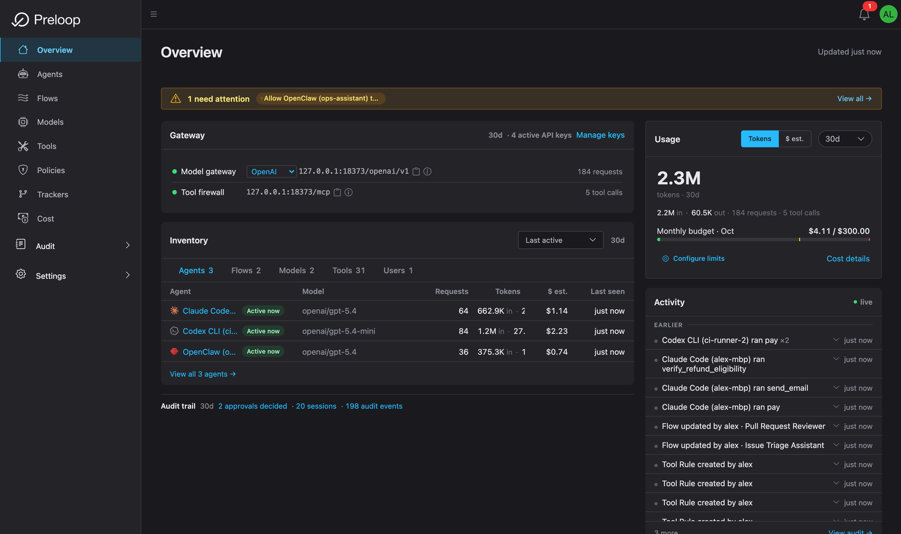
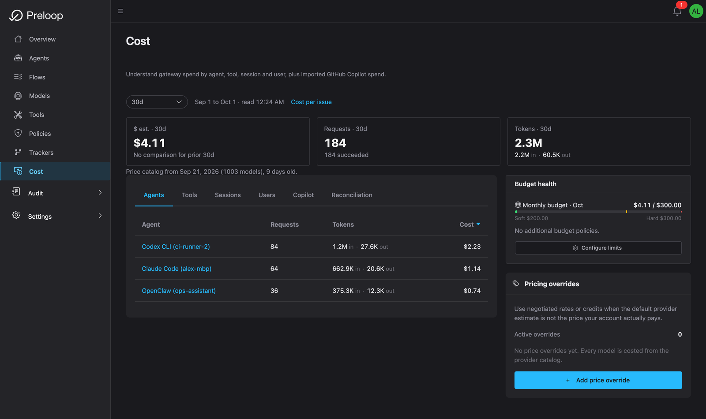

# The open-source control plane for AI agents

Editions: OSS, Cloud, Enterprise. Unless stated otherwise, everything on this page ships in OSS.

AI agents now deploy code, change infrastructure, move money, touch production data, and burn model spend, in seconds, without anyone in the loop. The problem is not that agents are useless. The problem is that uncontrolled tool access, model access, and runtime identity turn one bad prompt, one hallucination, or one compromised agent into a production incident, a runaway bill, or an audit gap.

**Preloop is the open-source control plane that sits between every agent and the systems it touches**: governing tool calls, routing risky actions to human approval, attributing and optimizing model spend, giving operators a live view of every session, and recording an audit trail of every decision.

<figure>
  
  <figcaption>One console for agent activity, policy decisions, model spend, and sessions.</figcaption>
</figure>

## Watch it work

A short series covering onboarding, the MCP firewall, human approvals, and cutting session cost: recorded end to end against a real stack.

<figure>
  <a href="https://www.youtube.com/watch?v=Y_geb2Or8zM&list=PLr2Jp0c-Qn2hoYL3aRZGUtBjTCVygWIXt">
    
  </a>
  <figcaption><a href="https://www.youtube.com/watch?v=Y_geb2Or8zM&list=PLr2Jp0c-Qn2hoYL3aRZGUtBjTCVygWIXt">Watch the full playlist &rarr;</a></figcaption>
</figure>

## What Preloop Does

Preloop covers the jobs teams otherwise stitch together from four or five separate vendors, in one self-hostable platform, working with the agents you already run.

- **MCP Firewall**: govern every tool call with ordered allow / deny / require-approval / require-justification rules (YAML + CEL). [Safety Layer →](guide/concepts/safety-layer.md)
- **AI Model Gateway**: route model traffic through an OpenAI- and Anthropic-compatible gateway for per-account and per-flow budgets, allowed-model lists, token accounting, and runtime attribution, without handing provider keys to agent containers. [Model Gateway →](guide/concepts/model-gateway.md)
- **Cost Analytics, Budgets & Optimization**: explain model spend by model, agent, session, API key, flow, and user; enforce budgets; and run the session-optimization loop (analyze a session, apply a fix, verify the saving with a measured replay) with your own model keys. [Cost Analytics →](guide/concepts/cost-analytics.md) · [Session Optimization →](guide/cost/session-optimization.md)
- **Human Approvals & Questions**: send risky tool calls (including native `Bash`/`Edit`, not just MCP tools) to mobile, watch, Slack, Mattermost, email, or webhook for a one-tap decision. Agents can also ask the operator a question with options or free text via the built-in `ask_user` tool and act on the answer. [Approvals →](guide/approvals/ai-approvals.md)
- **Runtime Observability**: a per-session timeline of tool calls, model calls, policy decisions, approvals, spend, and outcomes, with request-level replay. [Runtime Sessions →](guide/concepts/runtime-sessions.md)
- **Audit & AI Act Evidence**: durable logs with the matched policy, approver, inputs, timestamps, and outcome, ready for security review and EU AI Act work. Flow presets additionally turn a CI-emitted SBOM into a versioned evidence pack for a human assessor (evidence in, human assessment out, not a conformity assessment or certification). [Security & Privacy →](security/security-privacy.md) · [Security audit presets →](guide/flows/security-audit-presets.md)

Two more things make it practical to adopt:

- **Onboard existing agents in one command**: `curl -fsSL https://preloop.ai/install/cli | sh` discovers Claude Code, Codex CLI, Cursor, Gemini CLI, Hermes, OpenClaw, OpenCode and other MCP-compatible runtimes already installed on the machine, signs you up (if needed), and rewires them through Preloop without touching the agent's source. Every onboarded agent then appears on a live **Agents** canvas with its onboarding state and activity.
- **Agent Control**: for long-running agents (OpenClaw, Hermes today), a durable, audited channel to see presence, send operator messages, and keep any resulting tool/model work on the governed paths. [Agent Control adapters →](guide/integrations/agent-control-runtime-adapters.md)

This lets you keep fast automation for low-risk operations while keeping humans in control of risky actions and keeping model spend, sessions, and runtime behavior visible: starting from the agents you already use instead of rebuilding everything from scratch.

<figure>
  
  <figcaption>Model spend, explained: by agent, tool, session, and user, with budget health.</figcaption>
</figure>

## How it works

Every tool call and model call an onboarded agent makes flows through Preloop before it reaches the system it targets:

```text
AI Agent → Preloop → [Policy check]  → Allow / Deny / Require Approval → Execute
                   → [Model gateway] → Budget + attribution            → Model
                   → [Session + audit] → timeline, spend, evidence
```

<figure>
  
  <figcaption>Preloop evaluates policies before tool execution and routes risky actions to the right approval path.</figcaption>
</figure>

## Why Teams Use Preloop

- **Engineering** teams protect deployments, schema changes, and cloud operations.
- **Platform and DevOps** teams enforce access rules without rewriting existing tools.
- **Security and compliance** teams get auditability, runtime visibility, and human checkpoints for sensitive actions.
- **Finance and operations** teams apply approval workflows, budgets, and spend attribution to payments, refunds, and business-critical AI activity.

Preloop works with OpenClaw, OpenCode, Claude Code, Codex CLI, Gemini CLI, Hermes, Cursor, Cline, Windsurf, and other MCP-compatible agents or managed runtimes.

!!! info "Edition notes"
    - **Open Source** gives you the core control plane: policy enforcement, approvals (including native tool approvals) and `ask_user` questions, the model gateway, cost analytics and budgets, runtime sessions with the full session-optimization loop (analyze / apply / replay-verify, BYOK-powered), tracker integrations, agentic flows, and Agent Control backend APIs.
    - **Cloud / Enterprise** add richer controls: users, roles and teams, multi-approver and AI-driven approvals, per-user and per-team budgets with limit notifications, model price overrides (including multi-currency), metered hosted-model analysis, and provider billing reconciliation. See [Enterprise Billing & FinOps](guide/integrations/enterprise-billing.md).
    - **Mobile apps** are proprietary clients that work with hosted and self-hosted Preloop deployments.

## Start Here

Pick the quick start that matches what you want to do first:

- **[Onboard local agents with the CLI (60s)](guide/quickstart-cli.md)**: One-line install that discovers and rewires the agents already installed on your machine through Preloop. Recommended if you have Claude Code, Codex CLI, Gemini CLI, Hermes, OpenClaw, or OpenCode running locally.
- **[Part 1: Safety Layer (5 min)](guide/quickstart.md)**: Create your account, connect an MCP server, define layered allow / deny / approval rules, and test them with Claude Code.
- **[Part 2: Agentic Flows (5 min)](guide/quickstart-flows.md)**: Build an event-driven workflow that calls your protected tools through an AI model.

Once agents are onboarded, the [Cost Analytics](guide/concepts/cost-analytics.md) and [Runtime Sessions](guide/concepts/runtime-sessions.md) areas show what they did and what it cost.

If you want the full walkthrough first, watch the current demo on [YouTube](https://www.youtube.com/watch?v=okBvOn_TC9o).

**[Get Started →](guide/quickstart-cli.md)**
